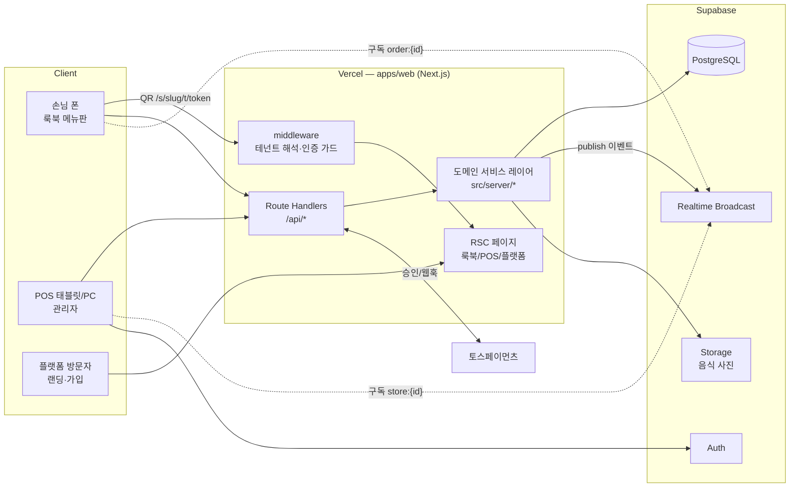

# 02. 시스템 아키텍처

- 버전: v0.1 (2026-07-12)
- 선행 문서: 01(요구사항) / 후행: 03(데이터), 04(API), 07(실시간)

## 1. 기술 스택 결정

| 레이어 | 선택 | 근거 | 기각한 대안 |
|---|---|---|---|
| 프레임워크 | **Next.js 15 (App Router) + React 19 + TypeScript** | 고객(SEO·초기로드 중요)과 POS(SPA성)를 한 코드베이스로. RSC로 룩북 이미지 페이지 서버 렌더 | 별도 SPA 2개(Vite) — 배포·공유코드 비용↑ |
| 스타일 | **Tailwind CSS v4 + shadcn/ui** + 커스텀 에디토리얼 토큰 | POS는 shadcn 생산성, 룩북은 토큰 기반 매거진 타이포 시스템 | CSS-in-JS — RSC 마찰 |
| DB | **PostgreSQL (Supabase 호스팅) + Prisma** | 관계형 정합성(주문/결제), Prisma 스키마가 에이전트 간 계약물 역할 | MongoDB — 정산 정합성 불리 |
| 인증 | **Supabase Auth** (이메일+비밀번호, 이후 소셜) | 세션/토큰 인프라 자체 구축 회피. 고객 표면은 무인증 | Auth.js — Realtime과 통합 시 이중화 |
| 실시간 | **Supabase Realtime (Broadcast)** + 폴링 폴백 | 별도 WS 서버 없이 매장 채널 pub/sub. 상세: docs/07 | 자체 Socket.io — Vercel 서버리스와 상성 나쁨(상시 프로세스 필요) |
| 스토리지 | **Supabase Storage** (음식 사진) + Next/Image 최적화 | 업로드 presign, 변환 파이프라인 단순 | S3+CloudFront — MVP 과설계 |
| 결제 | **토스페이먼츠** (결제위젯 + 빌링) | 국내 표준, 위젯으로 PCI 부담 없음. 상세: docs/08 | 아임포트 — 직접 연동으로 충분 |
| 배포 | **Vercel** (앱) + Supabase (DB/Auth/RT/Storage) | 프리뷰 배포가 에이전트 검증 루프와 궁합 | 자체 VPS — 운영 부담 |
| 모노레포 | **pnpm workspace + Turborepo** | 패키지 경계 = 에이전트 소유권 경계. 병렬 개발 충돌 최소화 | 단일 앱 폴더 — 소유권 경계 모호 |

> **Prisma × Supabase 주의**: Prisma는 서버(서비스 롤 커넥션, RLS 미적용)에서만 사용한다. 테넌트 격리는 §5의 repository 가드가 1차 방어선이며, RLS는 M6에서 2차 방어선으로 추가한다(고객/POS 클라이언트가 Supabase를 직접 읽는 경로는 Realtime 구독뿐이므로 채널 인가로 통제).

## 2. 시스템 구성도



## 3. 모노레포 구조 (M0 스캐폴드 목표)

```
table-order/
├── apps/
│   └── web/                          # Next.js 15 (App Router)
│       ├── app/
│       │   ├── (platform)/           # 랜딩, /join, /login, /super  ← auth-tenancy 소유
│       │   ├── (store)/s/[slug]/     # 고객 룩북                    ← lookbook-ui 소유
│       │   │   ├── page.tsx          #   커버+피드
│       │   │   ├── t/[tableToken]/   #   QR 진입점(테이블 바인딩)
│       │   │   ├── item/[itemId]/    #   메뉴 상세
│       │   │   ├── cart/             #   장바구니
│       │   │   └── orders/           #   주문 현황
│       │   ├── (admin)/s/[slug]/admin/  # POS                       ← pos-ui 소유
│       │   │   ├── page.tsx          #   주문 보드
│       │   │   ├── tables/           #   테이블·QR·세션
│       │   │   ├── menu/             #   메뉴 관리(+룩북 미리보기)
│       │   │   ├── checkout/         #   정산
│       │   │   ├── stats/            #   통계
│       │   │   └── settings/         #   매장·테마·직원 설정
│       │   └── api/                  # Route Handlers               ← backend-api 소유
│       │       ├── s/[slug]/         #   공개(고객) API
│       │       ├── admin/            #   관리자 API
│       │       ├── platform/         #   가입·구독 API
│       │       └── webhooks/toss/    #   PG 웹훅                    ← payments 소유
│       ├── middleware.ts             # 테넌트 해석·인증 가드         ← auth-tenancy 소유
│       ├── src/
│       │   ├── server/               # 도메인 서비스·repository      ← backend-api 소유
│       │   ├── auth/                 # 세션·역할·테넌트 컨텍스트     ← auth-tenancy 소유
│       │   ├── realtime/             # publish/subscribe 훅         ← realtime 소유
│       │   └── payments/             # 토스 클라이언트·정산 로직     ← payments 소유
│       └── tests/                    # 통합·E2E(Playwright)         ← qa 소유
├── packages/
│   ├── db/                           # Prisma schema·client·seed    ← db-schema 소유
│   ├── shared/                       # Zod 계약·도메인 타입·상수     ← backend-api 소유(리뷰: 전원)
│   └── ui/                           # 디자인 토큰·공용 컴포넌트     ← design-system 소유
├── docs/                             # 본 설계 문서 (SSOT)
├── .claude/agents/                   # 서브에이전트 정의
├── turbo.json / pnpm-workspace.yaml / package.json
└── CLAUDE.md / README.md
```

## 4. URL·라우팅 설계

| URL | 표면 | 인증 |
|---|---|---|
| `/` `/pricing` `/demo` | 플랫폼 랜딩 | 없음 |
| `/join` `/login` | 가입/로그인 | 없음 |
| `/onboarding/*` | 매장 개설 위저드 | 매장 계정 |
| `/s/[slug]` | 룩북(커버·피드) | 없음 |
| `/s/[slug]/t/[tableToken]` | QR 진입 → 테이블 세션 쿠키 심고 `/s/[slug]`로 | 없음(토큰) |
| `/s/[slug]/item/[itemId]` `/cart` `/orders` | 룩북 하위 | 없음(토큰) |
| `/s/[slug]/admin/**` | POS | 매장 스태프 + 해당 매장 소속 |
| `/super/**` | 슈퍼어드민 | PLATFORM_ADMIN |
| `/api/s/[slug]/**` | 공개 API | tableToken 검증 + rate limit |
| `/api/admin/**` | 관리자 API | 세션 + 테넌트 가드 |
| `/api/webhooks/toss` | PG 웹훅 | 서명 검증 |

**멀티테넌시 해석 순서** (middleware):
1. `/s/[slug]` → slug로 Store 캐시 조회(존재·ACTIVE 여부) → `x-store-id` 헤더 주입
2. `/admin` 하위 → 세션 사용자에게 해당 storeId 멤버십 없으면 403
3. (백로그) 커스텀 도메인: `Host` 헤더 → slug 매핑 테이블 → 내부 rewrite. path 기반 설계를 유지하면 무변경 확장 가능

**고객 테이블 바인딩**: QR의 `tableToken`으로 진입 시 서명된 httpOnly 쿠키 `mb_table`(storeId, tableId, sessionId 후보) 발급, 만료 3시간. 주문 API는 쿠키+토큰 재검증. 토큰은 테이블별 고정이되 POS에서 재발급(회전) 가능.

## 5. 테넌트 격리 (N-3 구현 전략)

1. **Repository 레이어 강제**: `src/server/repos/*`의 모든 함수는 첫 인자로 `tenantCtx: { storeId }`를 받으며, Prisma 호출은 repository 밖에서 금지(ESLint 규칙 `no-restricted-imports`로 `@menubook/db` 직접 import를 `src/server/repos` 외 차단).
2. **핸들러 가드**: 관리자 API는 `requireStaff(slug)` 헬퍼가 세션→멤버십→`tenantCtx` 생성. 고객 API는 `requireTable(slug, token)`이 생성.
3. **교차 테넌트 회귀 테스트**: qa 에이전트가 "매장 A 토큰으로 매장 B 자원 접근 → 403/404" 스위트를 전 엔드포인트에 대해 자동 생성·유지 (docs/04 §5 에러 규약).
4. **RLS(2차 방어선, M6)**: 핵심 테이블에 `store_id = auth.jwt()->>'store_id'` 정책. Prisma 서비스 커넥션은 예외로 두되, Realtime/Storage 직접 접근 경로에 적용.

## 6. 이미지 파이프라인 (룩북의 생명선)

1. POS 메뉴 관리에서 업로드 → `/api/admin/media/presign` → Supabase Storage 직접 업로드(원본, 최대 10MB)
2. 업로드 완료 콜백에서 서버가 변환 잡: 리사이즈 3종(2048/1024/480 w, WebP/AVIF), blurhash(→ `MenuImage.blurDataUrl`), 지배색 추출(→ 텍스트 스크림 색 결정)
3. 룩북은 `next/image` + `sizes` 지정, 커버·첫 화면 이미지만 `priority`, 나머지 lazy
4. 성능 예산: 첫 뷰포트 이미지 총량 < 400KB, LCP 이미지는 AVIF 우선

## 7. 환경/배포

| 환경 | 앱 | DB | 용도 |
|---|---|---|---|
| local | `pnpm dev` | Supabase 로컬(도커) 또는 dev 프로젝트 | 에이전트 개발 |
| preview | Vercel Preview (PR별) | dev Supabase | 마일스톤 검증·데모 |
| production | Vercel Prod | prod Supabase | 실서비스 |

환경변수(`.env.example`로 관리, 시크릿은 Vercel/로컬에만):
`DATABASE_URL`, `DIRECT_URL`, `NEXT_PUBLIC_SUPABASE_URL`, `NEXT_PUBLIC_SUPABASE_ANON_KEY`, `SUPABASE_SERVICE_ROLE_KEY`, `TOSS_CLIENT_KEY`, `TOSS_SECRET_KEY`, `TABLE_TOKEN_SECRET`, `APP_BASE_URL`

## 8. 확장 경로 (설계에 반영된 미래)

- **서브도메인/커스텀 도메인**: middleware 매핑만 추가 (§4)
- **다국어**: `MenuItem.i18n(Json)` 예약 컬럼, next-intl 도입 지점 문서화
- **자체 WS 서버 전환**: `src/realtime`의 publish/subscribe 인터페이스 뒤로 구현 교체 (docs/07 §6)
- **네이티브 앱(POS)**: API가 REST 계약이므로 Capacitor 래핑 가능
