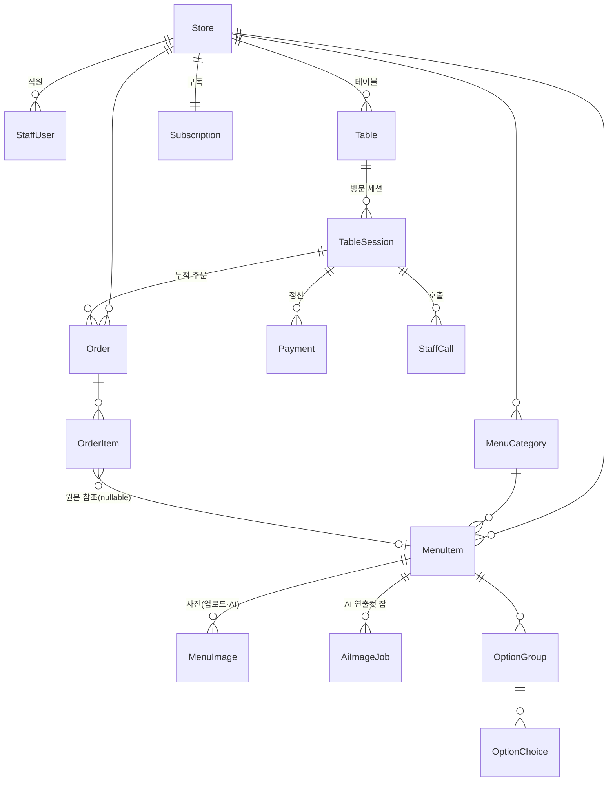
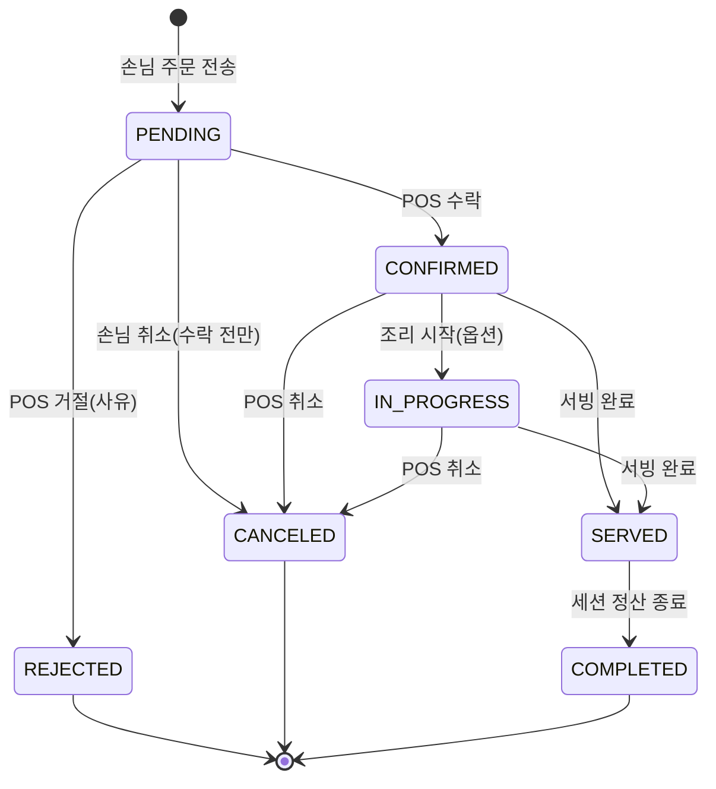
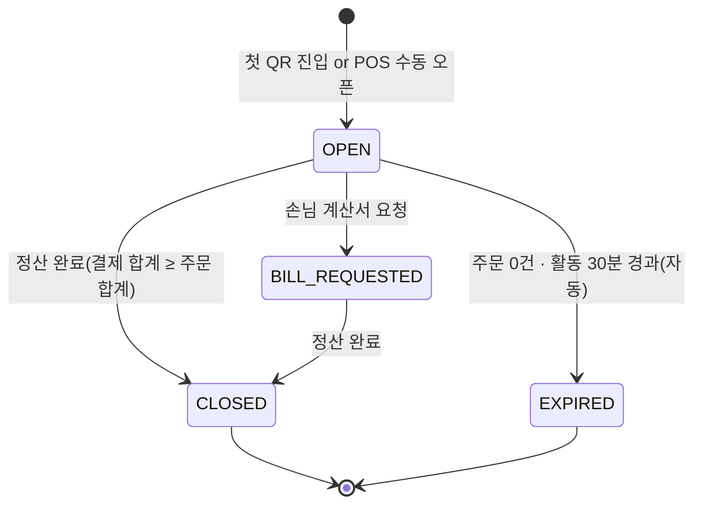

# 03. 데이터 모델

- 버전: v0.1 (2026-07-12)
- 이 문서의 Prisma 스키마는 **계약물**이다. 변경은 `db-schema` 에이전트만 수행하며, 변경 시 04(API)·07(실시간)·08(결제) 정합성 검토가 필수다.

## 1. ERD 개요



핵심 개념:
- **TableSession** = 한 팀의 방문(착석~정산). 주문·결제·호출이 세션에 묶인다. 정산·계산서의 단위.
- **스냅샷 원칙** = OrderItem은 주문 시점의 메뉴명/가격/옵션을 **복사 저장**한다. 이후 메뉴가 수정·삭제돼도 주문·정산 무결성이 유지된다.

## 2. Prisma 스키마 초안 (`packages/db/prisma/schema.prisma`)

```prisma
// ───────── 테넌트/구독 ─────────
model Store {
  id            String      @id @default(cuid())
  slug          String      @unique            // /s/[slug]
  name          String
  description   String?
  phone         String?
  address       String?
  status        StoreStatus @default(ONBOARDING)
  theme         Json        @default("{}")     // docs/05 §10 ThemeConfig
  coverImageUrl String?
  logoUrl       String?
  openingHours  Json        @default("{}")     // 요일별 {open,close,breakStart?...}
  settings      Json        @default("{}")     // StoreSettings: prepayRequired, useInProgressStatus, orderPauseUntil,
                                               // autoConfirmOrders, firstOrderManualConfirm(기본 true), skipPaymentRecord,
                                               // businessDayCutoff(기본 "06:00"), unconfirmedEscalation{afterMin,phone} ...
  createdAt     DateTime    @default(now())
  updatedAt     DateTime    @updatedAt

  staff         StaffUser[]
  tables        Table[]
  categories    MenuCategory[]
  items         MenuItem[]
  sessions      TableSession[]
  orders        Order[]
  payments      Payment[]
  calls         StaffCall[]
  subscription  Subscription?
  auditLogs     AuditLog[]
}

enum StoreStatus { ONBOARDING ACTIVE SUSPENDED CLOSED }

model StaffUser {
  id         String    @id @default(cuid())
  storeId    String
  authUserId String    @unique   // Supabase Auth user id
  email      String
  name       String
  role       StaffRole @default(STAFF)
  isActive   Boolean   @default(true)
  createdAt  DateTime  @default(now())
  store      Store     @relation(fields: [storeId], references: [id])

  @@index([storeId])
}

enum StaffRole { OWNER MANAGER STAFF }

model Subscription {
  id               String             @id @default(cuid())
  storeId          String             @unique
  plan             PlanType           @default(TRIAL)
  status           SubscriptionStatus @default(TRIALING)
  trialEndsAt      DateTime?
  currentPeriodEnd DateTime?
  billingKey       String?            // 토스 빌링키 (암호화 저장)
  failCount        Int                @default(0)
  aiCreditsUsed    Int                @default(0)  // 월 주기 리셋 — 한도는 PLAN_LIMITS.aiCreditsMonthly
  store            Store              @relation(fields: [storeId], references: [id])
}

enum PlanType { TRIAL BASIC PRO }
enum SubscriptionStatus { TRIALING ACTIVE PAST_DUE CANCELED }

// ───────── 테이블/세션 ─────────
model Table {
  id        String   @id @default(cuid())
  storeId   String
  label     String                  // "1", "테라스 A"
  qrToken   String   @unique        // 서명 검증용 랜덤(회전 가능)
  sortOrder Int      @default(0)
  isActive  Boolean  @default(true)
  store     Store    @relation(fields: [storeId], references: [id])
  sessions  TableSession[]

  @@unique([storeId, label])
  @@index([storeId])
}

model TableSession {
  id          String        @id @default(cuid())
  storeId     String
  tableId     String
  status      SessionStatus @default(OPEN)
  openedAt    DateTime      @default(now())
  closedAt    DateTime?
  totalAmount Int           @default(0)   // 주문 확정 누계(원). 파생값이지만 정산 성능 위해 유지
  store       Store         @relation(fields: [storeId], references: [id])
  table       Table         @relation(fields: [tableId], references: [id])
  orders      Order[]
  payments    Payment[]
  calls       StaffCall[]

  @@index([storeId, status])
  @@index([tableId, status])
}

enum SessionStatus { OPEN BILL_REQUESTED CLOSED EXPIRED }
// EXPIRED = 주문 0건 세션이 마지막 활동 30분 경과로 자동 정리된 상태(유령 세션 — 정산 불변식 I-5 무관, 통계 제외)

// ───────── 메뉴 ─────────
model MenuCategory {
  id        String   @id @default(cuid())
  storeId   String
  name      String                  // "시그니처", "브런치", "내추럴 와인"
  tagline   String?                 // 목차에 실리는 한 줄 (매거진 챕터 부제)
  displayMode ChapterDisplayMode @default(SPREAD) // SPREAD=화보 스프레드 / INDEX=차림 인덱스 지면(음료·주류 권장, docs/05 §4.4)
  sortOrder Int      @default(0)
  isActive  Boolean  @default(true)
  store     Store    @relation(fields: [storeId], references: [id])
  items     MenuItem[]

  @@index([storeId, sortOrder])
}

enum ChapterDisplayMode { SPREAD INDEX }

model MenuItem {
  id          String    @id @default(cuid())
  storeId     String
  categoryId  String
  name        String
  summary     String?               // 피드 카드 한 줄
  story       String?               // 상세 페이지 에디토리얼 본문(마크다운 허용)
  price       Int                   // 원 단위 정수
  badges      String[]  @default([]) // SIGNATURE | NEW | BEST | SPICY | VEGAN ...
  layoutHint  LayoutHint @default(AUTO) // 룩북 편집 배치 힌트 (docs/05 §4)
  isSoldOut   Boolean   @default(false)
  isHidden    Boolean   @default(false)
  deletedAt   DateTime?             // soft delete (N-8)
  sortOrder   Int       @default(0)
  ingredients Json?                 // [{name, note?, emphasize?}] — 재료·구성 표기 겸 AI 연출컷 입력(docs/12)
  i18n        Json?                 // 다국어 예약 (백로그)
  store       Store     @relation(fields: [storeId], references: [id])
  category    MenuCategory @relation(fields: [categoryId], references: [id])
  images      MenuImage[]
  optionGroups OptionGroup[]
  orderItems  OrderItem[]
  aiJobs      AiImageJob[]

  @@index([storeId, categoryId, sortOrder])
}

enum LayoutHint { AUTO HERO SPREAD GRID STORY }

model MenuImage {
  id          String  @id @default(cuid())
  itemId      String
  url         String              // Storage 경로 (원본)
  blurDataUrl String?             // blurhash → base64
  dominantHex String?             // 텍스트 스크림 색 결정용
  width       Int
  height      Int
  sortOrder   Int     @default(0)
  source      ImageSource @default(UPLOAD)
  aiJobId     String?             // 생성 출처 잡 (source=AI_GENERATED)
  labels      Json?               // 분해컷 재료 라벨 [{text, x, y}] — 렌더 스펙은 docs/05 §5
  item        MenuItem @relation(fields: [itemId], references: [id])

  @@index([itemId, sortOrder])
}

enum ImageSource { UPLOAD AI_GENERATED }

model AiImageJob {
  id          String       @id @default(cuid())
  storeId     String
  itemId      String
  style       AiImageStyle
  mood        String?              // "dark-wood" | "hanji-light" | "stone" ...
  prompt      String               // 최종 프롬프트 스냅샷 (재현성·감사)
  provider    String               // "imagen" | "gpt-image" ...
  status      AiJobStatus  @default(QUEUED)
  candidates  Json         @default("[]")  // admin 전용 Storage URL 목록
  selectedUrl String?
  creditCost  Int          @default(1)
  error       String?
  createdAt   DateTime     @default(now())
  finishedAt  DateTime?
  item        MenuItem     @relation(fields: [itemId], references: [id])

  @@index([storeId, createdAt])
}

enum AiImageStyle { HERO DECONSTRUCTED CLOSEUP }
enum AiJobStatus { QUEUED GENERATING READY SELECTED DISCARDED FAILED }

model OptionGroup {
  id        String  @id @default(cuid())
  itemId    String
  name      String              // "샷 추가", "굽기 정도"
  minSelect Int     @default(0) // 1 이상이면 필수 그룹
  maxSelect Int     @default(1)
  sortOrder Int     @default(0)
  item      MenuItem @relation(fields: [itemId], references: [id])
  choices   OptionChoice[]
}

model OptionChoice {
  id         String  @id @default(cuid())
  groupId    String
  name       String
  priceDelta Int     @default(0)  // ±원
  isSoldOut  Boolean @default(false)
  sortOrder  Int     @default(0)
  group      OptionGroup @relation(fields: [groupId], references: [id])
}

// ───────── 주문 ─────────
model Order {
  id           String      @id @default(cuid())
  storeId      String
  sessionId    String
  tableId      String                    // 조회 성능 위한 비정규화
  orderNo      Int                       // 매장·영업일 기준 순번 (POS 표시용)
  status       OrderStatus @default(PENDING)
  totalAmount  Int                       // 라인합계 합. 스냅샷 기준
  customerMemo String?
  deviceId     String?                   // 발신 기기 uuid(mb_table 쿠키) — 다인 테이블 분쟁 증빙(docs/06 §4)
  rejectReason String?
  placedAt     DateTime    @default(now())
  confirmedAt  DateTime?
  servedAt     DateTime?
  canceledAt   DateTime?
  store        Store        @relation(fields: [storeId], references: [id])
  session      TableSession @relation(fields: [sessionId], references: [id])
  items        OrderItem[]

  @@index([storeId, status, placedAt])
  @@index([sessionId])
}

enum OrderStatus {
  PENDING      // 손님 전송, POS 미확인 (신규 알림 대상)
  CONFIRMED    // 직원 수락
  IN_PROGRESS  // 조리중 (매장 설정으로 생략 가능: settings.useInProgressStatus)
  SERVED       // 서빙 완료
  COMPLETED    // 세션 정산 종료 시 일괄 마감
  REJECTED     // 직원 거절 (사유 필수)
  CANCELED     // 손님/직원 취소 (CONFIRMED 이전만 손님 취소 가능)
}

model OrderItem {
  id              String  @id @default(cuid())
  orderId         String
  menuItemId      String?             // 원본 참조. 메뉴 hard-delete 방지用 nullable
  nameSnapshot    String
  priceSnapshot   Int                 // 옵션 제외 단가
  optionsSnapshot Json    @default("[]") // [{group, choice, priceDelta}]
  qty             Int
  lineTotal       Int                 // (priceSnapshot + Σdelta) × qty
  order           Order   @relation(fields: [orderId], references: [id])
  menuItem        MenuItem? @relation(fields: [menuItemId], references: [id])

  @@index([orderId])
}

// ───────── 결제/호출/감사 ─────────
model Payment {
  id             String        @id @default(cuid())
  storeId        String
  sessionId      String
  method         PaymentMethod
  status         PaymentStatus @default(READY)
  amount         Int
  idempotencyKey String        @unique   // 중복 결제 방지 (docs/08 §4)
  pgProvider     String?                 // "toss"
  pgPaymentKey   String?       @unique
  pgOrderId      String?       @unique   // 토스에 넘기는 우리측 키
  receiptUrl     String?
  approvedAt     DateTime?
  canceledAt     DateTime?
  failReason     String?
  createdAt      DateTime      @default(now())
  store          Store         @relation(fields: [storeId], references: [id])
  session        TableSession  @relation(fields: [sessionId], references: [id])

  @@index([storeId, createdAt])
}

enum PaymentMethod { COUNTER_CASH COUNTER_CARD PG_CARD PG_EASY_PAY }
enum PaymentStatus { READY PAID PARTIAL_REFUNDED REFUNDED FAILED CANCELED }

model StaffCall {
  id        String     @id @default(cuid())
  storeId   String
  tableId   String
  sessionId String?
  kind      CallKind
  status    CallStatus @default(OPEN)
  createdAt DateTime   @default(now())
  doneAt    DateTime?
  store     Store        @relation(fields: [storeId], references: [id])
  session   TableSession? @relation(fields: [sessionId], references: [id])

  @@index([storeId, status])
}

enum CallKind { STAFF BILL WATER CUSTOM }
enum CallStatus { OPEN DONE }

model AuditLog {
  id        String   @id @default(cuid())
  storeId   String?
  actorType String              // STAFF | CUSTOMER | SYSTEM | SUPER
  actorId   String?
  action    String              // ORDER_CONFIRM, MENU_UPDATE, SESSION_CLOSE ...
  target    String?             // "order:abc123"
  payload   Json?
  createdAt DateTime @default(now())
  store     Store?   @relation(fields: [storeId], references: [id])

  @@index([storeId, createdAt])
}

model PlatformAdmin {
  id         String @id @default(cuid())
  authUserId String @unique
  name       String
}
```

## 3. 상태머신 (전이 외 변경 금지 — 서비스 레이어에서 가드)

### 3.1 Order



### 3.2 TableSession



- 세션 CLOSE 시: 소속 SERVED 주문 → COMPLETED 일괄 전이, `totalAmount` 확정, 테이블 QR 진입 시 새 세션 생성.
- 미정산 CLOSE 금지(강제 종료는 MANAGER 이상 + AuditLog).

### 3.3 Payment — docs/08 §4 참조 (READY→PAID→REFUNDED 계열)

## 4. 도메인 불변식 (서비스 레이어 + 테스트로 보증)

| # | 불변식 |
|---|---|
| I-1 | OrderItem 금액은 항상 스냅샷 기준으로 계산·저장 (`lineTotal = (priceSnapshot + Σ optionsSnapshot.priceDelta) × qty`) |
| I-2 | `Order.totalAmount = Σ items.lineTotal` — 생성 트랜잭션 내에서 서버가 재계산(클라이언트 금액 신뢰 금지) |
| I-3 | 품절(`isSoldOut`)·숨김·삭제 **메뉴 및 품절 옵션 선택지(OptionChoice.isSoldOut)**는 주문 생성 시점 서버 검증에서 거부 (`SOLD_OUT`) |
| I-4 | 상태 전이는 §3 다이어그램에 있는 간선만 허용, 위반 시 `INVALID_TRANSITION` |
| I-5 | 세션 CLOSE 조건: `Σ payments(PAID).amount ≥ Σ orders(CONFIRMED 이상, 취소 제외).totalAmount` |
| I-6 | 모든 조회/변경은 storeId 스코프 (02 §5) |
| I-7 | `orderNo`는 매장×**영업일**(`settings.businessDayCutoff`, 기본 06:00 경계 — 자정 넘김 영업 대응) 단위 단조 증가. stats `today`·일 마감 리포트·'오늘만 품절' 해제가 모두 같은 경계를 공유한다 |
| I-8 | AI 생성 이미지는 운영자 **선택·승인 전(MenuImage 확정 전)에는 고객 표면에 절대 노출되지 않는다** — 후보 URL은 admin 전용 경로에만 존재 |

## 5. 마이그레이션·시드 정책

- 마이그레이션은 `prisma migrate dev` 산출물을 커밋(리뷰 대상). 파괴적 변경(컬럼 삭제 등)은 expand→migrate→contract 3단계.
- **시드(필수 산출물)**: 데모 매장 1개 — 슬러그 `demo`, 테이블 8개, 카테고리 4개(시그니처/브런치/디저트/음료), 메뉴 18개(플레이스홀더 이미지 + blurhash), 옵션그룹 예시, 진행중 세션·주문 샘플, **AI 분해컷 샘플 1개(라벨 데이터 포함, source=AI_GENERATED)**. 모든 UI 에이전트는 이 시드로 개발·스크린샷한다.
