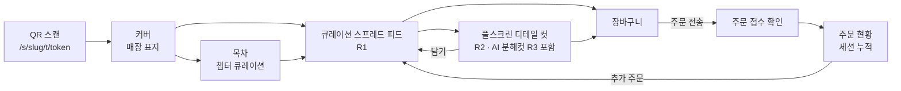

# 05. 룩북 메뉴판 UX/UI 설계 (고객 표면)

- 버전: **v0.2** (2026-07-12) — 오너 제공 레퍼런스 이미지 3종 기준으로 뷰 구조 재정의: v0.1의 "피드+바텀시트" 구조를 **큐레이션 스프레드 + 풀스크린 디테일 컷 + AI 연출컷** 3요소 구조로 격상
- 구현 소유: `lookbook-ui` 에이전트 (`apps/web/app/(store)`), 토큰·공용 컴포넌트는 `design-system`(`packages/ui`), AI 생성은 docs/12
- 데이터: `GET /api/s/[slug]/lookbook` (docs/04 §2)
- 시각화 목업: [`design/menu-style-concept.html`](../design/menu-style-concept.html)

## 0. 레퍼런스 무드보드 (제품 오너 제공 — 디자인의 기준점)

| ID | 레퍼런스 | 우리가 가져올 것 |
|---|---|---|
| **R1** | 한식 브랜드 지면 메뉴("발효미학" 스타일): 세로쓰기 국문 타이포 + 인장(印章) 모티프 + 지면 하나에 메뉴 3~4개를 편집 배치, 메뉴마다 수식어 문구("발효 간장이 들어간")·국/영문명·가격 | **큐레이션 스프레드** — 전체 메뉴를 상품 진열이 아니라 '편집된 지면'의 연속으로 |
| **R2** | 요리책 커버("GALBI — A Shared Table Tradition"): 대형 영문 세리프 타이틀 + 서브타이틀 + 풀블리드 연출 사진 | **풀스크린 디테일 컷** — 메뉴 하나를 화보 커버처럼, 음식을 크게 자세히 |
| **R3** | 재료 분해컷: 다크 배경 위 재료들이 공중 부양하며 세로로 쌓이고 각 재료에 라벨+리더라인 | **AI 연출컷(분해컷)** — 재료 입력만으로 이런 실사 연출 이미지를 생성 (docs/12) |

## 1. 디자인 원칙

1. **사진이 주인공** — UI 크롬은 사진을 방해하지 않는다. 썸네일 그리드 금지.
2. **지면(紙面)처럼 편집한다** — 목록이 아니라 스프레드. 여백·타이포·사진 배치가 챕터마다 리듬을 만든다(R1).
3. **디테일은 화보로** — 주문할 음식을 '자세히 본다'는 행위 자체가 경험이다. 상세 = 정보 패널이 아니라 풀스크린 화보(R2).
4. **타이포그래피가 브랜드다** — 세로쓰기 국문, 대형 영문 세리프, 수식어 문구. 매장이 고르는 서체 무드가 잡지의 성격을 정한다.
5. **주문은 마찰 없이** — 감상 흐름을 끊지 않는 하단 주문바, 화보 안에서 바로 담기.
6. **사진이 부족한 매장도 못생기지 않게** — AI 연출컷(docs/12)과 타이포 전용 폴백이 안전망.

## 2. 화면 흐름



## 3. 화면별 스펙

### 3.1 진입 & 커버 (`/s/[slug]/t/[token]` → `/s/[slug]`)
- QR 진입 시: 토큰 검증(`POST table-entry`) → 쿠키 발급 → 커버로. 실패(비활성 토큰/매장 정지) 시 안내 화면.
- 커버 = 잡지 표지: 풀스크린 커버 이미지(테마), 매장 로고타입, 매장명 + 한 줄 소개 + `TABLE 7` 배지(내 테이블 — 신뢰 신호). 테마에 따라 세로 타이포 커버(R1 무드) 또는 영문 세리프 커버(R2 무드).
- 재진입 시 커버는 헤더로 접힘. 영업시간 외: "지금은 주문을 받지 않아요 (11:00 오픈)" 오버레이, 열람은 허용.

### 3.2 목차 (챕터 큐레이션)
- 카테고리를 매거진 목차처럼: `01 발효 미학 — 한국인의 건강한 지혜에서 찾은`, `02 브런치 — 오전 11시의 위로` (name + tagline).
- 목차 항목 터치 → 해당 스프레드로 스무스 스크롤. 피드 상단에 얇은 챕터 인덱스(가로 스크롤, 현재 챕터 하이라이트) 고정.

### 3.3 큐레이션 스프레드 피드 (R1 — 핵심 화면)

피드는 아이템 목록이 아니라 **챕터(카테고리) 단위 스프레드의 연속**이다.

- **스프레드 구성** = 챕터 표제부 + 아이템 3~4개의 편집 배치:
  - **챕터 표제부**: 챕터 넘버·이름·tagline. 테마 옵션에 따라 ① 세로쓰기 표제 패널(writing-mode: vertical-rl, 배경 지색 블록 + 인장 모티프 — R1의 좌측 초록 패널) ② 가로형 대형 타이포. 표제부는 스프레드에 sticky하게 붙어 스크롤 시 지면의 축 역할.
  - **아이템 편집 배치 패턴 4종** (`MenuItem.layoutHint`, AUTO는 규칙 기반):
    | 패턴 | 구성 | AUTO 배치 규칙 |
    |---|---|---|
    | HERO | 풀블리드 4:5 사진 + 스크림 위 텍스트 | 챕터 첫 아이템, SIGNATURE 배지 |
    | SPREAD | 사진 2장 좌우 오프셋(화보 스프레드) | 이미지 2장 이상인 연속 2개 |
    | GRID | 2단 비대칭(60/40) | 일반 아이템 짝 |
    | STORY | 사진 55% + 여백에 수식어·인용 세로 배치 | story 보유 아이템, 3~4개 간격 |
- **아이템 캡션 구조(R1 문법)**: ① 수식어 한 줄(위, 작게 — "발효 흑초를 넣은 초고추장과") ② 이름(디스플레이체, 크게 — "꼬막 해초 비빔밥") ③ 영문명(letter-spacing 오너먼트) ④ 가격(조용하게, tabular-nums). 수식어는 `MenuItem.summary`를 사용.
- 배지 칩(SIGNATURE는 인장풍 스탬프 모티프 옵션), 품절 시 사진 데새추레이트 + "SOLD OUT" 스탬프. 우하단 원형 `+` 퀵담기(옵션 필수 메뉴는 디테일 컷으로).
- 이미지: `next/image`, 4:5 기본 크롭, blur placeholder, 뷰포트 밖 lazy.

### 3.4 풀스크린 디테일 컷 (R2 — `/s/[slug]/item/[id]`)

아이템 탭 → **풀스크린 화보 페이지로 전환**(v0.1의 바텀시트에서 격상. 퀵담기 옵션 선택만 바텀시트 유지).

- **컷 스와이프 캐러셀(세로 풀블리드)**: 연출컷 → 클로즈업 → **AI 분해컷**(있다면) 순서. 인디케이터는 얇은 바 + 컷 종류 라벨(연출/클로즈업/재료).
- **커버 타이포존(첫 컷)**: 상단에 대형 타이틀 — 영문명이 있으면 영문 세리프 대문자(R2의 "GALBI"), 서브타이틀로 국문명 또는 수식어. 테마 dropCap 시 스토리 첫 글자 드롭캡.
- **분해컷 라벨 렌더**: `MenuImage.labels` 데이터를 오버레이로 렌더 (§5).
- 스크롤 다운 → 스토리(에디토리얼 문단), 재료·구성 리스트(`ingredients` — 알레르기 참고 겸용), 태그 칩.
- 옵션 그룹: 필수(minSelect≥1) 라디오/체크, priceDelta `+500` 표기. 수량 스테퍼 + `₩12,000 담기` 풀폭 버튼(합계 실시간). 담기 → 화보로 복귀 + 주문바 뱃지 바운스.
- 닫기: 상단 ← 또는 아래로 스와이프(화보→스프레드 shared-element 복귀 모션).

### 3.5 주문바 & 장바구니
- 하단 고정 주문바(스크롤 다운 시 축소): `가방 아이콘 + 2건 · ₩25,000 주문하기`.
- 장바구니: 라인아이템(이름/옵션/수량 스테퍼/삭제 스와이프), 요청 메모, 합계.
- `주문 전송` → 멱등키 생성 → `POST orders` → 접수 화면(주문번호 크게 `No. 14`, "주방에 전달됐어요") → 현황으로.
- 선결제 매장(`settings.prepayRequired`): 전송 대신 토스 결제위젯 시트(docs/08) → 승인 후 접수.

### 3.6 주문 현황 (`/s/[slug]/orders`)
- 세션 누적 내역: 주문별 카드 + 상태 타임라인 `접수됨 → 확인 → 조리중 → 서빙완료`(매장 설정으로 조리중 생략 가능).
- 실시간: `session:{id}` 구독 + 10s 폴링 폴백(docs/07 §4). 거절 시 사유 표시 + 합계 제외.
- 하단: 세션 합계, `직원 호출` `계산서 요청`(60s 쿨다운), 선결제 영수증 링크.

## 4. 분해컷 라벨 렌더러 (R3 — F-22)

AI 분해컷의 재료 라벨은 이미지에 굽지 않고 **데이터로 오버레이**한다 (선명한 타이포·수정 가능·다국어 확장).

```ts
type IngredientLabel = { text: string; x: number; y: number }  // x,y: 0~100 (% 좌표)
```

- 렌더 규칙: 앵커점(x,y)에서 좌/우 가까운 여백 쪽으로 리더라인(1px, 45°꺾임 허용) + 라벨 텍스트(소형 캡스, letter-spacing). 라벨이 화면 밖/상호 겹침 시 자동으로 반대편 배치.
- 라벨 타이포는 테마 토큰을 따르되 대비 보장(다크 배경 전제 — 분해컷 프리셋은 다크 무드 권장).
- 라벨 편집(위치 드래그·문구)은 POS 스튜디오에서(docs/06 §5, docs/12 §2). 고객 표면은 읽기 전용 렌더.
- 업로드 사진에도 동일 스키마로 라벨을 달 수 있다(AI 전용 아님 — 촬영컷 분해 연출을 직접 만든 매장도 지원).

## 5. 모션 & 마이크로 인터랙션 (절제: 200~350ms, ease-out)

- 커버→스프레드: 커버 이미지가 헤더로 축소되는 스크롤 전환
- 스프레드 표제부: 진입 시 대형 타이포 페이드+미세 상승, 사진 패럴랙스(0.9배속)
- 스프레드→디테일 컷: 사진 shared-element 확장(풀스크린), 복귀는 역재생
- 분해컷: 컷 진입 시 라벨이 리더라인 그려지며 순차 페이드-인(120ms 스태거)
- 담기: `+` → 체크 morph, 주문바 뱃지 스프링. 품절 실시간: 데새추레이트+스탬프 스냅
- `prefers-reduced-motion` 존중 — 전부 페이드 대체

## 6. 성능·접근성 예산 (NFR N-1, N-6)

- LCP(커버) < 2.5s/4G: 커버만 priority + AVIF, Storage 도메인 프리커넥트
- 스프레드 피드: 첫 챕터만 SSR, 이후 지연 마운트. 디테일 컷은 스프레드에서 보이는 아이템의 첫 컷만 prefetch. 고객 표면 JS < 180KB gzip
- 사진 위 텍스트: 하단 그라디언트 스크림(dominantHex 기반) + 대비 4.5:1, 폰트 최소 14px
- 시맨틱: 스프레드는 `<section>`+`<article>`, 가격 `aria-label`, 풀스크린 화보는 route 기반(뒤로가기 동작 보장), 라벨 렌더러는 `<figure>/<figcaption>` 구조

## 7. 테마 시스템 (`Store.theme` — ThemeConfig v2)

```ts
// packages/shared/src/contracts/theme.ts (Zod)
type ThemeConfig = {
  paletteMode: "light" | "dark";             // 지면 배경 (다크=나이트 다이닝/분해컷 무드)
  accentHex: string;                         // 배지·버튼·표제 패널
  displayFont: "serif-editorial" | "serif-classic" | "sans-modern" | "sans-grotesk";
  bodyFont: "sans" | "serif";
  coverLayout: "center" | "bottom-left" | "vertical";  // vertical = R1 세로 타이포 커버
  chapterTitleStyle: "vertical-panel" | "horizontal";  // 스프레드 표제부 (R1 세로 패널)
  chapterMotif: "none" | "seal" | "rule";              // 인장 스탬프 / 괘선 오너먼트
  paperTexture: "none" | "hanji" | "grain";            // 지면 질감 (한지/필름 그레인)
  chapterNumbering: boolean;
  dropCap: boolean;
}
```

- 폰트는 셀프호스팅 4종 고정 세트(Noto Serif KR, Nanum Myeongjo, Pretendard, 영문 세리프 페어 — 라이선스 확인). 임의 웹폰트 업로드는 받지 않는다(성능·라이선스).
- `design-system`이 토큰 → CSS 변수(`--mb-*`)로 매핑, 룩북 루트에서 주입. POS·플랫폼 표면은 테마 영향 없음.
- 인장(seal) 모티프: 매장명 1~2자 또는 심볼을 전각(篆刻)풍 프레임에 — SVG 컴포넌트로 제공(design-system).

## 8. 빈 상태·엣지

- 사진 없는 메뉴: 타이포 전용 카드(지배색 배경 + 대형 이름) — 그리고 **"AI 연출컷 만들기"를 POS에 제안**(연결고리, docs/12)
- 미검수 AI 후보는 고객 표면에 절대 노출 금지(I-8) — 룩북 쿼리는 `MenuImage`만 조회(후보는 별개 저장소 경로)
- AI 생성 이미지에는 컷 모서리에 소형 `AI 생성` 고지 배지(기본 ON, 매장 설정으로 문구 조정 — 법무 검토 docs/09 §6)
- 카테고리 0/메뉴 0(온보딩 미리보기): 플레이스홀더 화보 + "메뉴를 등록하면 이 자리에 화보가 실립니다"
- 오프라인: 마지막 룩북 캐시 + 주문 불가 배너. 세션 만료(3h)/정산 후: "새 세션을 시작할까요?" → QR 재스캔 유도

## 9. 변경 이력

| 버전 | 변경 |
|---|---|
| v0.2 | 레퍼런스 R1~R3 반영: 피드→큐레이션 스프레드 재정의, 상세 바텀시트→풀스크린 디테일 컷 격상, 분해컷 라벨 렌더러(§4) 신설, ThemeConfig v2(세로 타이포·인장·지면 질감) |
| v0.1 | 최초 작성 |
