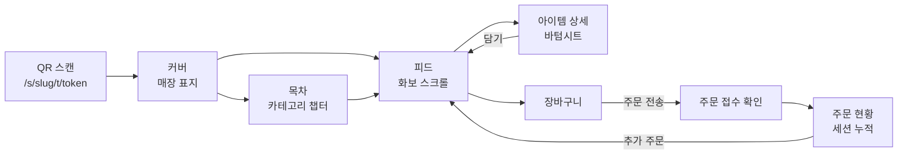

# 05. 룩북 메뉴판 UX/UI 설계 (고객 표면)

- 버전: v0.1 (2026-07-12)
- 구현 소유: `lookbook-ui` 에이전트 (`apps/web/app/(store)`), 토큰·공용 컴포넌트는 `design-system`(`packages/ui`)
- 데이터: `GET /api/s/[slug]/lookbook` (docs/04 §2)

## 1. 디자인 원칙

1. **사진이 주인공** — UI 크롬은 사진을 방해하지 않는다. 버튼·칩·바는 사진 밖 또는 스크림 위 최소한으로. 썸네일 그리드 금지, 기본 단위는 풀블리드 카드.
2. **편집 리듬(Editorial Rhythm)** — 같은 레이아웃 반복은 카탈로그다. 히어로 → 스프레드 → 그리드 → 스토리 순의 리듬으로 '넘기는 맛'을 만든다.
3. **타이포그래피가 브랜드다** — 아이템명은 크게(디스플레이 세리프 옵션), 가격은 조용하게. 국/영문 병기 시 영문을 오너먼트로 활용.
4. **주문은 마찰 없이** — 감상 흐름을 끊지 않는 하단 고정 주문바, 상세는 페이지 이동 대신 바텀시트.
5. **매장의 옷을 입는다** — 테마 변수(§6)로 매장마다 다른 잡지가 되게 한다. 서비스 로고는 푸터에만.

## 2. 화면 흐름



## 3. 화면별 스펙

### 3.1 진입 & 커버 (`/s/[slug]/t/[token]` → `/s/[slug]`)
- QR 진입 시: 토큰 검증(`POST table-entry`) → 쿠키 발급 → 커버로. 실패(비활성 토큰/매장 정지) 시 안내 화면.
- 커버 = 잡지 표지: 풀스크린 커버 이미지(테마), 상단에 매장 로고타입, 중앙 하단에 매장명 + 한 줄 소개 + "Vol." 대신 `TABLE 7` 배지(내 테이블 표시 — 신뢰 신호).
- 스크롤 유도 힌트(↓ 미세 모션). 커버는 첫 방문 세션에서만 풀로 보여주고 재진입 시 축약(헤더로 접힘).
- 영업시간 외: 커버 위 "지금은 주문을 받지 않아요 (11:00 오픈)" 오버레이, 메뉴 열람은 허용.

### 3.2 목차 (챕터)
- 카테고리를 매거진 목차처럼: `01 시그니처 — 셰프의 자부심`, `02 브런치 — 오전 11시의 위로` (name + tagline).
- 탭이 아니라 **챕터 점프**: 목차 항목 터치 → 피드 해당 섹션으로 스무스 스크롤. 피드 상단에 얇은 챕터 인덱스(가로 스크롤, 현재 챕터 하이라이트) 고정.

### 3.3 피드 (핵심 화면)
- 세로 스크롤 단일 컬럼. 각 챕터는 챕터 헤더(넘버링 + 대형 타이포)로 시작.
- **편집 레이아웃 4종** — `MenuItem.layoutHint`(AUTO|HERO|SPREAD|GRID|STORY)로 결정, AUTO는 규칙 기반 자동 배치:
  | 패턴 | 구성 | 자동 배치 규칙 |
  |---|---|---|
  | HERO | 풀블리드 4:5 사진 + 하단 스크림 위 이름/한줄/가격 | 챕터 첫 아이템, SIGNATURE 배지 |
  | SPREAD | 사진 2장 나란히(3:4), 좌우 오프셋으로 화보 스프레드 느낌 | 이미지 2장 이상인 연속 2개 아이템 |
  | GRID | 2단 비대칭(60/40) 카드 2개 | 일반 아이템 짝 |
  | STORY | 사진 위 아니라 옆: 사진 55% + 여백에 스토리 인용문 세로 배치 | story가 있는 아이템 3~4개 간격 |
- 카드 공통: 이름(디스플레이체), summary 한 줄, 가격(우측 하단, tabular-nums), 배지 칩(품절 시 사진 데새추레이트 + "SOLD OUT" 스탬프), 우하단 원형 `+` 퀵담기(옵션 필수 메뉴는 상세로).
- 이미지: `next/image`, 4:5 고정 크롭(art direction은 매장 업로드 시 포컬포인트 선택 — M5), blur placeholder, 뷰포트 밖 lazy.

### 3.4 아이템 상세 (바텀시트, `/s/[slug]/item/[id]` 딥링크 겸용)
- 스와이프 가능한 사진 캐러셀(인디케이터는 얇은 바), 아래로: 이름, 스토리(에디토리얼 문단 — 첫 글자 드롭캡 옵션), 알레르기/태그 칩.
- 옵션 그룹: 필수(minSelect≥1)는 라디오/체크 + 미선택 시 담기 비활성, priceDelta는 `+500` 형식.
- 수량 스테퍼 + `₩12,000 담기` 풀폭 버튼(합계 실시간 갱신). 담기 → 시트 닫힘 + 주문바 뱃지 바운스.

### 3.5 주문바 & 장바구니
- 하단 고정 주문바(스크롤 다운 시 축소): `가방 아이콘 + 2건 · ₩25,000 주문하기`.
- 장바구니: 라인아이템(이름/옵션/수량 스테퍼/삭제 스와이프), 요청 메모 입력, 합계.
- `주문 전송` → 멱등키 생성 → `POST orders` → 성공 시 접수 화면(주문번호 크게 `No. 14`, "주방에 전달됐어요") → 현황으로.
- 선결제 매장(`settings.prepayRequired`): 전송 대신 토스 결제위젯 시트(docs/08) → 승인 후 접수.

### 3.6 주문 현황 (`/s/[slug]/orders`)
- 세션 누적 내역: 주문별 카드 + 상태 타임라인 `접수됨 → 확인 → 조리중 → 서빙완료` (매장 설정에 따라 조리중 생략).
- 실시간: `order:{id}` 채널 구독 + 10s 폴링 폴백(docs/07 §4). 거절 시 사유 표시 + 해당 금액 합계 제외.
- 하단: 세션 합계, `직원 호출` `계산서 요청` 버튼(호출 후 60s 쿨다운), 선결제 매장은 결제 영수증 링크.

## 4. 모션 & 마이크로 인터랙션 (절제 원칙: 200~350ms, ease-out, 감속 위주)

- 커버→피드: 커버 이미지가 헤더로 축소되는 shared-element 느낌의 스크롤 전환
- 챕터 헤더: 진입 시 대형 타이포 페이드+미세 상승, 스크롤 패럴랙스(사진 대비 0.9배속)
- 담기: `+` → 체크 morph, 주문바 카운트 뱃지 스프링
- 품절 실시간 반영: 카드가 데새추레이트되며 스탬프 스냅 등장 (menu.updated 이벤트)
- `prefers-reduced-motion` 존중 — 전부 페이드로 대체

## 5. 성능·접근성 예산 (NFR N-1, N-6)

- LCP(커버 이미지) < 2.5s/4G: 커버만 priority + AVIF, 프리커넥트 Storage 도메인
- 피드 초기 렌더: 첫 챕터만 SSR, 이후 챕터 지연 마운트. JS 번들(고객 표면) < 180KB gzip
- 사진 위 텍스트: 하단 그라디언트 스크림(dominantHex 기반) + 대비 4.5:1 보장, 폰트 최소 14px
- 시맨틱: 피드는 `<article>` 리스트, 가격 `aria-label="가격 12,000원"`, 시트 포커스 트랩

## 6. 테마 시스템 (`Store.theme` — ThemeConfig)

```ts
// packages/shared/src/contracts/theme.ts (Zod)
type ThemeConfig = {
  paletteMode: "light" | "dark";            // 지면 배경 (다크=나이트 다이닝 무드)
  accentHex: string;                        // 배지·버튼·하이라이트
  displayFont: "serif-editorial" | "serif-classic" | "sans-modern" | "sans-grotesk";
  bodyFont: "sans" | "serif";
  coverLayout: "center" | "bottom-left";    // 커버 타이포 배치
  chapterNumbering: boolean;                // 목차/챕터 01,02 넘버링
  dropCap: boolean;                         // 스토리 드롭캡
}
```

- 폰트는 셀프호스팅 4종 고정 세트(라이선스 확인: Noto Serif KR, Nanum Myeongjo, Pretendard, 산세리프 영문 페어) — 임의 웹폰트 업로드는 받지 않는다(성능·라이선스).
- `design-system`이 토큰 → CSS 변수(`--mb-accent`, `--mb-display-font`...)로 매핑, 룩북 루트에서 주입. POS·플랫폼 표면은 테마 영향 없음(서비스 고정 스킨).

## 7. 빈 상태·엣지

- 사진 없는 메뉴: 타이포 전용 카드(지배색 배경 + 대형 이름) — 사진 없어도 '못생기지 않게'가 원칙
- 카테고리 0/메뉴 0(온보딩 중 미리보기): 플레이스홀더 화보 + "메뉴를 등록하면 이 자리에 화보가 실립니다"
- 오프라인: 마지막 룩북 캐시 표시 + 주문 불가 배너
- 세션 만료(3h)/정산 완료 후 접근: "새 세션을 시작할까요?" → QR 재스캔 유도(무단 재주문 방지)
