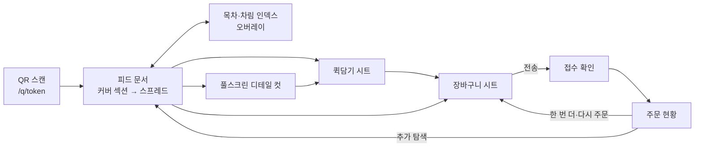

# 05. 룩북 메뉴판 UX/UI 설계 (고객 표면)

- 버전: **v0.3** (2026-07-15) — 5렌즈 설계 검증(49건 비평→3심 판정) 반영. 핵심: **"감상은 선택, 주문은 즉시"** — 인터랙션·성능 예산을 수치로 강제하고, 진입/담기/재주문/카트의 마찰을 제거
- 구현 소유: `lookbook-ui` (`apps/web/app/(store)`), 토큰·공용 컴포넌트 `design-system`, AI 생성 docs/12
- 시각화 목업: [`design/menu-style-concept.html`](../design/menu-style-concept.html)

## 0. 레퍼런스 무드보드 (제품 오너 제공 — 디자인 기준점)

| ID | 레퍼런스 | 우리가 가져올 것 |
|---|---|---|
| **R1** | 한식 브랜드 지면 메뉴("발효미학"): 세로쓰기 국문 타이포+인장 모티프+지면 하나에 메뉴 3~4개 편집 배치, 수식어·국/영문명·가격 | **큐레이션 스프레드** — 전체 메뉴를 '편집된 지면'의 연속으로 |
| **R2** | 요리책 커버("GALBI"): 대형 세리프 타이틀+풀블리드 연출 사진 | **풀스크린 디테일 컷** — 메뉴 하나를 화보처럼 크게 |
| **R3** | 재료 분해컷: 재료 공중부양+라벨 | **AI 연출컷** — 재료 입력만으로 실사 연출 (docs/12) |

> R1 원전의 핵심은 "지면 하나에 3~4개"다. 화보 문법은 **밀도 규칙(§4.4)** 안에서만 허용된다 — 감성을 이유로 스크롤을 폭발시키지 않는다.

## 1. 디자인 원칙

1. **사진이 주인공** — UI 크롬 최소. 썸네일 그리드 금지(단, §4.3 '차림 인덱스'는 쇼핑몰 그리드가 아니라 **타이포 지면**이다 — 예외로 명시).
2. **지면처럼 편집한다** — 목록이 아니라 스프레드. 단, 뷰포트당 밀도 예산(§4.4)을 지킨다.
3. **감상은 선택, 주문은 즉시** — 모든 감상 요소(커버·스토리·화보)는 주문 경로를 한 탭도 늘릴 수 없다. 담기·주문 CTA는 항상 첫 프레임부터 도달 가능하다.
4. **디테일은 화보로** — 상세 = 풀스크린 화보(R2). 단 담기는 화보 안에서 스크롤 0회로.
5. **타이포그래피가 브랜드다** — 세로쓰기·수식어·세리프. 메뉴 식별 정보(국문명·가격)는 장식보다 우선한다.
6. **사진이 부족해도 못생기지 않게** — AI 연출컷(docs/12)과 타이포 폴백이 안전망.
7. **한 손, 어두운 홀, 나쁜 네트워크가 기본 환경** — 엄지 존·저조도 가독·오프라인 내성을 전제로 설계한다.

## 2. UX 예산 (설계·QA 게이트 — qa 수용 기준과 1:1)

| # | 예산 | 목표 |
|---|---|---|
| B-1 | QR 카메라 인식 → 첫 음식 사진 가시 | **p75 < 4s** (중저가 안드로이드 실기기 포함 리허설) |
| B-2 | QR 진입 → 옵션 없는 메뉴 1개 주문 완료 | **≤ 4탭 · 30초** |
| B-3 | 스프레드에서 담기 (옵션 필수 1그룹) | **≤ 3탭 · 화면 전환 0회** |
| B-4 | 디테일 컷 경유 주문 | ≤ 6탭 |
| B-5 | 추가 주문(현황 화면에서 동일 메뉴) | **≤ 3탭 · 10초** |
| B-6 | 잠금·리로드·결제 왕복 후 카트 복원 | 100% (유실 0) |
| B-7 | 부분 품절 시 주문 복구 | ≤ 2탭 |
| B-8 | 착석 중 세션 만료 복구 | 1탭 (재스캔 없음) |

## 3. 화면 흐름



커버는 별도 화면이 아니라 **피드 문서의 최상단 100vh 섹션**이고, 장바구니는 페이지가 아니라 **바텀시트**다 — 화면 전환을 늘리는 노드를 플로우에서 제거했다.

## 4. 화면별 스펙

### 4.1 진입 (QR → 메뉴, 1왕복)

- QR 인쇄 URL은 **단축 경로 `/q/[token]`** (40자 이내 → QR 버전 3~4 유지, 저조도 스캔 성공률↑).
- `/q/[token]`은 **GET 단일 응답**으로 처리: 서버(RSC)에서 토큰 검증 + `Set-Cookie(mb_table)` + 피드 HTML 렌더까지 한 응답에 담는다(리다이렉트 금지, URL 정리는 클라이언트 `replaceState`). 기존 `POST table-entry`는 쿠키 재발급용 보조 API로 강등.
- **세션 이중화(인앱브라우저 대응)**: 응답 바디로도 서명 세션 토큰을 내려 sessionStorage에 보관, 고객 API는 `X-Table-Token` 헤더 폴백 허용. 진입 직후 쿠키 self-check 1회 → 실패 시 무감지 헤더 모드 전환. (카카오톡·네이버·인스타 인앱과 iOS 쿠키 차단 설정 대비)
- **쿠키 만료는 슬라이딩**: 활동(주문·호출·현황 조회) 시마다 +3h 연장, 절대 상한 = 세션 CLOSE. 만료 처리 UX는 §9.
- 실패 케이스: 비활성 토큰/매장 정지/SUSPENDED → 안내 화면. 영업시간 외 → 열람 허용 + "지금은 주문을 받지 않아요 (11:00 오픈)" 배너.

### 4.2 커버 (피드 최상단 섹션)

- 잡지 표지 문법(테마: 세로 타이포/영문 세리프/센터), 매장 로고타입 + `TABLE 7` 배지.
- **첫 스프레드 상단 15~20%를 하단에 peek 노출** + `메뉴 펼치기 ↓` CTA 1개(탭 → 첫 챕터로). 스크롤 힌트 모션 1회.
- 재진입·추가주문 복귀: 커버 스킵(헤더로 접힘) + **마지막 스크롤 위치 복원**.

### 4.3 목차 = 차림 인덱스 (풀스크린 오버레이)

목차를 카테고리 이름 나열에서 **전 메뉴 차림표 지면**으로 확장한다 — 잡지 인덱스 페이지 문법(지면 질감·괘선·서체 토큰 유지, 사진 없음).

- 구성: 챕터 표제(`01 발효미학 — tagline`) 아래 아이템 행: **이름 + 가격(tabular-nums) + 품절 취소선 + 우측 `+` 퀵담기**. 행높이 ≥ 56px.
- 진입점: **헤더 `목차` 버튼 상시** + 챕터 인덱스 바 우측 `전체 메뉴` 고정 버튼. 어디서든 1탭.
- 항목 탭 → 해당 스프레드 위치로 **즉시 점프**(스무스 스크롤 금지 — 미마운트 챕터를 수천 px 지나며 스켈레톤을 노출하는 문제 방지) + 대상 챕터 우선 마운트(지색 블록+타이포 스켈레톤 200ms 내).
- 효용: 전 메뉴·가격 파악 ≤ 3뷰포트, 목적형 손님(재방문·급한 손님·40~60대)의 fast lane.

### 4.4 큐레이션 스프레드 피드 (R1)

- 챕터 표제부: 세로쓰기 패널(테마 옵션) 또는 가로형 대형 타이포 + 인장/괘선 모티프. sticky.
- 캡션 문법(R1): ① 수식어(위, 작게) ② 이름(디스플레이체) ③ 영문명(오너먼트) ④ 가격(조용하게). `summary`=수식어.
- **밀도 규칙 (AUTO 배치의 상한 — 렌더러 테스트로 검증)**:
  | 규칙 | 값 |
  |---|---|
  | 기본 지면(≈100vh)당 아이템 | 2~4개 (뷰포트당 평균 노출 카드 ≥ 1.8개) |
  | HERO(1지면 1아이템) | **챕터당 최대 1회** — SIGNATURE 초과분은 GRID 강등 |
  | 대형 패턴(HERO/SPREAD/STORY) 연속 배치 | 금지 — 사이에 GRID 짝 강제 |
  | 아이템 9개 이상 챕터 | GRID 비중 ≥ 50% |
  | 시드 18메뉴 피드 총길이 | ≤ 12뷰포트 (M2 DoD 실측) |
- **챕터 표시 모드**: `MenuCategory.displayMode: SPREAD | INDEX`(기본 SPREAD). INDEX 챕터(음료·주류 등 화보 가치 낮고 추가주문 빈도 높은 챕터)는 표제부만 유지하고 아이템은 §4.3 리스트 컴포넌트로 렌더 — 음료 12종 기준 8뷰포트 → 2뷰포트.
- 배지 칩·품절 스탬프(데새추레이트)·`+` 퀵담기(우하단). 사진/이름 탭 = 디테일 컷, `+` 탭 = 퀵담기 시트(§4.5) — **역할 분리 고정**.
- 세션 주문 이력 ≥ 1건이면 피드 상단에 **`다시 주문` 가로 스트립**(72px 미니 카드, 최대 6개, 직전 주문 순).

### 4.5 퀵담기 시트 (신설 — B-3의 실행 장치)

`+`는 옵션 유무와 무관하게 **스프레드 위 바텀시트에서 종결**한다 (v0.2의 "옵션 필수 메뉴는 디테일 컷으로" 규칙 폐지 — 속도가 가장 필요한 주력 메뉴에 감상을 강제하던 모순 제거).

- 구성: 대표컷 96px 썸네일 + 이름/가격 + 옵션 그룹(있다면) + 수량 스테퍼 + `담기`.
- 탭 예산: 옵션 0그룹 = 1탭(시트 생략, 즉시 담김 + 1.5s 미니 스테퍼 노출 — 재탭 = 수량+1), 필수 1그룹 = 3탭 이내.
- 필수 그룹 미선택 시 담기 비활성 + 첫 미선택 그룹으로 자동 스크롤.

### 4.6 풀스크린 디테일 컷 (R2 — `/s/[slug]/item/[id]`)

- **제스처 축 분리(오조작 방지)**: 컷 전환 = **가로 스와이프**(인디케이터 가로), 스토리·재료 = 세로 스크롤, 닫기 = scrollTop 0에서 pull-down ≥ 80px(저항 곡선) + 우상단 닫기 버튼(히트 48×48). 같은 세로 제스처에 3역할을 겹치지 않는다.
- 컷 순서: 연출컷 → 클로즈업 → AI 분해컷(라벨 오버레이 §5). 어포던스: 다음 컷 12px 엣지 피크 + 진입 1회 넛지 모션, 컷 라벨(연출/클로즈업/재료)은 탭 가능한 세그먼트.
- 커버 타이포존: `ThemeConfig.titleLang`(기본 **ko-first**) — 국문명이 대제목, 영문은 오너먼트. R2식 영문 대제목은 매장이 명시 선택 시(en-first)만.
- **콘텐츠 순서(주문 우선)**: 첫 컷 직하에 옵션 그룹 → 그 아래 '더 읽기' 영역으로 스토리·재료·태그(감상은 선택).
- **`₩12,000 담기` CTA는 진입 첫 프레임부터 하단 고정**(높이 56px + safe-area). 필수 옵션 미선택 상태에서 탭 → 옵션 존 자동 스크롤. 옵션 없는 메뉴는 어느 위치에서든 1탭 담기.
- 담기 → 화보 유지 + 주문바 뱃지 바운스(복귀 강제 없음).

### 4.7 주문바 & 장바구니 시트

- 하단 고정 주문바: 레이블 `장바구니 · 2건 · ₩25,000` ('주문하기' 동사는 시트의 전송 버튼에만 — 오전송 불안 제거). 카트 0건이면 숨김, 첫 담기에 스프링 등장. 높이 ≥ 56px + safe-area. 좌측에 **벨 아이콘 상시**(직원 호출/물/계산서 시트 — 어느 화면에서든 2탭).
- 장바구니 = **바텀시트**(페이지 아님): 라인아이템(이름/옵션/스테퍼/스와이프 삭제), 메모, 합계, `주문 전송`. 접수 확인(No.14)도 시트 내 표시 후 현황 링크.
- **카트 지속성 (B-6)**: 담기마다 `localStorage["mb_cart:{storeId}:{sessionId}"]` 저장. 마운트·`visibilitychange(visible)` 시 세션 유효성+품절·가격 diff 검증 후 복원, 변경은 토스트로 고지("품절로 1개를 뺐어요" — 무언 실패 금지). 주문 201 성공·세션 CLOSED/만료 시 클리어. 선결제는 confirm 200 전까지 보존.
- **전송 상태기계 (약한 네트워크)**: 멱등키 = 카트 스냅샷 해시(카트 불변 시 재탭·재시도 모두 동일 키). 전송 중 버튼 잠금 + "주방에 보내는 중…", 10s 타임아웃 → 동일 키 자동 재시도 1회 → 실패 시 `다시 시도` 버튼. 재시도 직전 `GET /session`으로 접수 여부 자가 확인 → 이미 접수면 즉시 접수 화면 전환. (계약 테스트: 타임아웃 후 동일 키 재전송 = 주문 1건)
- **품절 충돌 복구 (B-7)**: 409 `SOLD_OUT` 수신 → `details.menuItemIds`로 해당 라인 자동 마킹 + `품절 빼고 다시 주문` 원탭(제외 후 새 멱등키 재전송). 전량 품절 → 스프레드 복귀 CTA.

### 4.8 주문 현황 (`/s/[slug]/orders`)

- 세션 누적 내역 + 상태 타임라인 `접수됨 → 확인 → 조리중 → 서빙완료`(설정에 따라 조리중 생략).
- 접수 직후 문구 "주방에 전달됐어요" → POS 확인 이벤트 수신 시 **"매장이 확인했어요 ✓"**로 승격(신뢰 신호). PENDING 3분 초과 시 `아직 매장 확인 전이에요 — 직원 호출` 버튼 자동 노출.
- **`＋ 한 번 더` (B-5)**: 라인아이템별 버튼 — 탭 → 수량 미니시트(동일 옵션 스냅샷 재사용) → `바로 주문`(기존 `POST orders` 재사용, 서버가 품절·가격 재검증 — 계약 변경 없음). 품절/삭제 메뉴는 비활성+사유. 가격 변경 시 시트로 고지.
- 하단: 세션 합계, 호출 시트(벨), 계산서 요청, 선결제 영수증 링크.
- **영수증 뷰**: 세션 CLOSED 후에도 24h 동안 읽기 전용 열람 가능(주문·시각·금액 — 정산 순간의 분쟁 증빙, docs/06 §4와 짝).

### 4.9 선결제 매장 (모드 B — docs/08)

- 위젯 진입 전 화면에 매장 상호·사업자명 1줄(전상법 표기 겸 신뢰 신호).
- **인앱브라우저 분기**: 인앱 UA 감지 시 결제 직전 `기본 브라우저에서 계속하기` 시트(앱별 스킴 대응표는 docs/08 §3) — 카드사 앱 복귀 실패 예방. 복귀 시 세션 토큰 승계 규칙 적용(§4.1 이중화).
- 1건째 담기는 순간 위젯 SDK prefetch(체감 1~3s 단축). `customerKey=sessionId`로 간편결제 수단 재사용 — **2차 주문부터 결제 포함 ≤ 15s**.
- 실패/이탈/10분 만료 → 카트 보존 상태로 장바구니 시트 복귀 + `결제 다시 시도`/`직원 호출` 배너.

## 5. 분해컷 라벨 렌더러 (R3 — F-22)

v0.2와 동일: `IngredientLabel {text, x, y}` 데이터 오버레이, 리더라인 자동 배치·충돌 회피, POS에서 편집·고객 표면 읽기 전용, 업로드 사진에도 동일 스키마 허용. 라벨 타이포는 대비 보장(분해컷은 다크 무드 권장).

## 6. 실시간 정책 (고객 표면 — docs/07과 1:1)

- **브라우징 중 WS 구독 금지**(배터리·동시 연결·JS 25KB 절약): 품절 반영은 ① lookbook CDN 캐시 60s ② 퀵담기 시트·디테일 컷·카트 열람 시 재검증 ③ 주문 시 서버 거부(§4.7 복구)로 담보.
- `session:{id}` 구독은 **주문 현황 화면이 열려 있을 때만** lazy 연결(supabase-js 동적 import — 첫 로드 JS에서 제외) + 10s 폴링 병행. 폴링 응답에 품절 diff 포함.

## 7. 모션 (절제: 200~350ms, ease-out)

- 허용 목록: 커버 축소 전환, 표제부 페이드+상승, 스프레드→디테일 shared-element, 분해컷 라벨 스태거(120ms), 담기 morph·뱃지 스프링, 품절 스탬프 스냅.
- **구현 제약**: transform/opacity만(레이아웃 속성 애니메이션 금지), 패럴랙스는 IntersectionObserver+translate3d 컴포지터 전용, JS 모션 라이브러리 예산 ≤ 8KB gzip(View Transitions·CSS 우선, framer-motion 풀 번들 금지).
- `prefers-reduced-motion` → 전부 페이드. `deviceMemory ≤ 4` 또는 `saveData` → 패럴랙스·스태거 자동 오프(동일 폴백 경로).

## 8. 성능·접근성 예산 (NFR N-1·N-6 구체화)

| 항목 | 예산 |
|---|---|
| LCP(커버) | **p75 < 1.8s** (Slow 4G 스로틀), TTFB < 600ms, 커버 `<link rel=preload>` + 첫 챕터 첫 이미지 1장 priority |
| 첫 음식 사진 가시 | < 3.5s(4G) — B-1과 연동 |
| INP / TBT / 스크롤 | INP < 200ms(p75), TBT < 250ms, 스프레드·캐러셀 ≥ 55fps (갤럭시 A2x급 실기기 리허설) |
| 이미지 변형 | **480/768/1080/1440w**(2048은 관리자 전용), srcset DPR cap 2, 사전 변형을 Storage/CDN에서 직접 서빙(런타임 재변환 배제) |
| 이미지 바이트 상한(변환 파이프라인에서 강제) | 커버 ≤ 180KB · 피드 컷 ≤ 120KB · 디테일 컷 ≤ 160KB (AVIF q40~50, 초과 시 자동 재인코딩) — '크게'는 픽셀 면적으로, 바이트는 상한으로 |
| 첫 뷰포트 이미지 총량 | < 300KB |
| JS(고객 표면) | < 180KB gzip, supabase-js·토스 SDK는 동적 import |
| 절약 모드 | `saveData`/`effectiveType∈{2g,3g}` → 480w 고정 + prefetch 중단 |
| 터치 | 모든 인터랙티브 요소 **히트영역 ≥ 44×44px**(시각 22px 허용 — 히트존만 확장, 가격행 우측 44px 전체가 퀵담기 히트존), 인접 간격 ≥ 8px, CTA 48px |
| 타이포 하한(이원화) | 주문 결정 정보(가격·품절·CTA) ≥ 16px·대비 7:1 / 수식어·오너먼트 ≥ 12px·4.5:1, rem 기반(시스템 글꼴 확대 반영), 메뉴명 ≥ 17px |
| 스크림 | 하단 그라디언트 최대 불투명도 55%·사진 세로 하위 40% 이내 (가독성을 이유로 사진을 덮지 않는다) |
| 시맨틱 | 스프레드 `<section>/<article>`, 가격 aria-label, 디테일 컷 route 기반(뒤로가기 보장), 시트 포커스 트랩 |

## 9. 빈 상태·엣지

- **백그라운드 복귀**: `visibilitychange(visible)` 시 세션 유효성+품절 재조회 1회, 현황 화면이면 즉시 `GET session`. 카트는 §4.7 규칙으로 복원.
- **세션 만료 2케이스 분리**: ① 만료됐지만 세션 OPEN(정산 전) → 화면 내 `이어서 주문하기` 원탭(토큰 재검증→쿠키 재발급, 재스캔 없음 — B-8) ② 세션 CLOSED(정산 후·다른 팀 가능성)·토큰 회전 → 재스캔 유도 + 24h 영수증 뷰 링크.
- 사진 없는 메뉴: 타이포 전용 카드(지배색+대형 이름) + POS에 "AI 연출컷 만들기" 제안(docs/12).
- 미검수 AI 후보 노출 금지(I-8), AI 생성 컷 모서리 `AI 생성` 고지 배지(기본 ON).
- 오프라인: 마지막 룩북 캐시 + 주문 불가 배너. 온보딩 미리보기: 플레이스홀더 화보.

## 10. 테마 시스템 (`Store.theme` — ThemeConfig v2)

```ts
// packages/shared/src/contracts/theme.ts (Zod)
type ThemeConfig = {
  paletteMode: "light" | "dark";             // 지면 배경 (다크=나이트 다이닝·분해컷 무드) — "auto"(조도·시간대)는 백로그
  accentHex: string;                         // 배지·버튼·표제 패널
  displayFont: "serif-editorial" | "serif-classic" | "sans-modern" | "sans-grotesk";
  bodyFont: "sans" | "serif";
  coverLayout: "center" | "bottom-left" | "vertical";  // vertical = R1 세로 타이포 커버
  chapterTitleStyle: "vertical-panel" | "horizontal";  // 스프레드 표제부
  chapterMotif: "none" | "seal" | "rule";              // 인장 스탬프 / 괘선
  paperTexture: "none" | "hanji" | "grain";            // 지면 질감
  chapterNumbering: boolean;
  dropCap: boolean;
  titleLang: "ko-first" | "en-first";                  // 디테일 컷 대제목 언어 (기본 ko-first — §4.6)
}
```

- 폰트는 셀프호스팅 4종 고정 세트(Noto Serif KR, Nanum Myeongjo, Pretendard, 영문 세리프 페어 — 라이선스 확인). 임의 웹폰트 업로드는 받지 않는다(성능·라이선스).
- `design-system`이 토큰 → CSS 변수(`--mb-*`) 매핑, 룩북 루트에서 주입. POS·플랫폼 표면은 테마 영향 없음. 인장(seal) 모티프는 SVG 컴포넌트로 제공.

## 11. 변경 이력

| 버전 | 변경 |
|---|---|
| v0.3 | 설계 검증(49건→3심) 반영: UX 예산 §2 신설(4탭·30초 등 8종), 진입 GET 1왕복+/q/ 단축+세션 이중화(인앱), 커버=피드 섹션+peek, 목차→차림 인덱스, 밀도 규칙·INDEX 챕터 모드, 퀵담기 시트 일원화(§4.5), 디테일 컷 주문 우선 재배열+제스처 축 분리+ko-first, 카트 지속성+전송 상태기계+품절 복구, 재주문(한 번 더·다시 주문 스트립), 영수증 뷰 24h, 선결제 인앱 분기+customerKey, 고객 WS lazy 정책, 성능 예산 상향(LCP 1.8s·INP·바이트 상한·변형 세트 재정의), 터치·타이포 하한 이원화 |
| v0.2 | 레퍼런스 R1~R3 반영(스프레드·풀스크린 디테일 컷·라벨 렌더러·테마 v2) |
| v0.1 | 최초 작성 |
