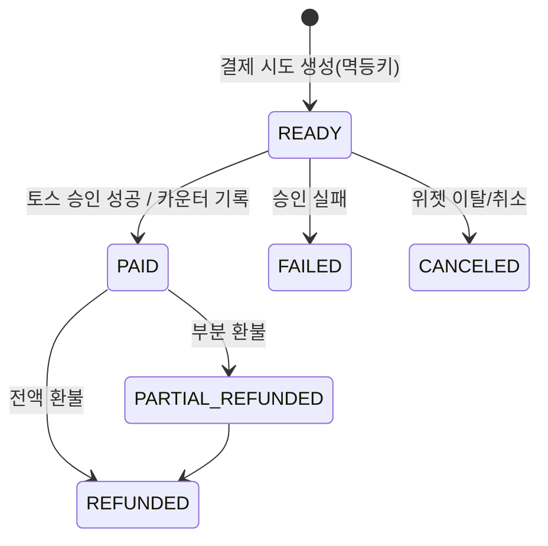
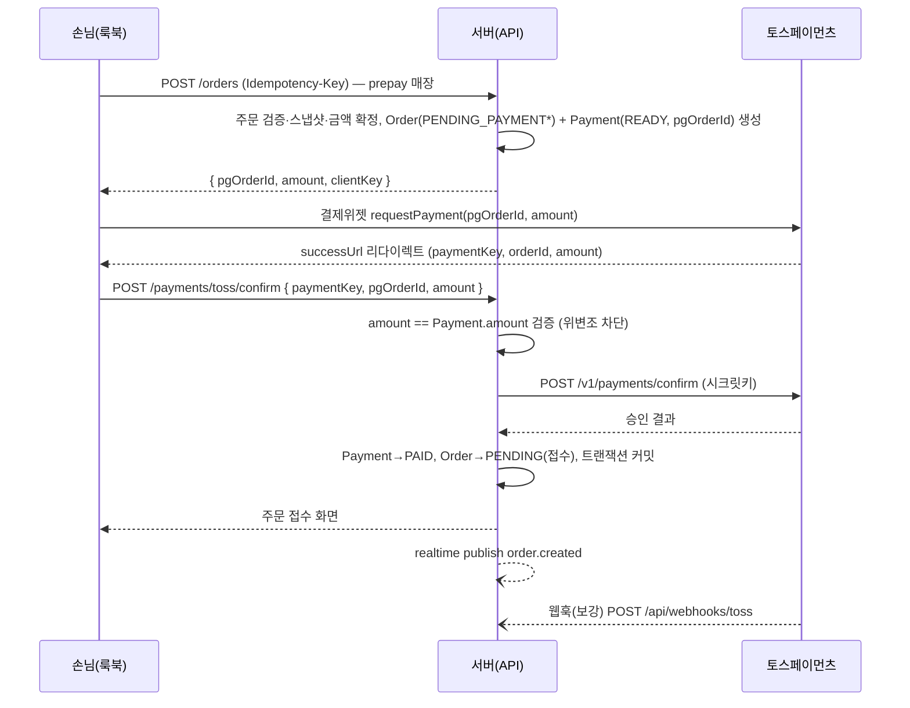

# 08. 결제 설계 — 매장 정산 & SaaS 구독

- 버전: v0.1 (2026-07-12)
- 구현 소유: `payments` 에이전트 (`apps/web/src/payments`, `app/api/webhooks/toss`). 정산 UI는 `pos-ui`, 결제위젯 UI는 `lookbook-ui`와 협업(계약: docs/04).
- PG: **토스페이먼츠** (일반결제 위젯 + 빌링). 키는 환경변수, 시크릿은 서버 전용.

## 1. 결제 모드 매트릭스

| 모드 | 흐름 | 기본값 | 마일스톤 |
|---|---|---|---|
| **A. 후불 카운터 결제** | 식후 카운터에서 현금/카드단말 → POS에 기록(COUNTER_CASH/CARD) → 세션 CLOSE | ✅ 기본 | M4 |
| **B. 선결제 (PG)** | 주문 전송 시 토스 결제위젯으로 결제 → 승인 후 주문 접수 | `settings.prepayRequired` | M4 |
| C. 테이블에서 후불 QR 정산 | 계산서 요청 → 손님 폰에서 세션 합계 PG 결제 | 백로그 | — |

혼합 세션 허용: 선결제 주문 + 후불 주문이 한 세션에 공존 가능. 정산 화면은 `총액 − PG결제 합계 = 카운터 수납액`을 자동 계산(docs/06 §4, 불변식 I-5).

## 2. 데이터·상태 (docs/03 Payment 모델)

- 카운터 결제는 READY를 거치지 않고 POS 기록 시 즉시 PAID 생성(멱등키 = POS 클라이언트 생성 uuid).
- 환불: PG 결제는 토스 취소 API 경유, 카운터 결제는 기록 취소(MANAGER↑ + AuditLog). 주문 거절(REJECTED)된 선결제 주문은 **자동 부분 환불** 잡 생성.

## 3. 선결제 시퀀스 (토스 결제위젯)

`*` 선결제 매장 한정 내부 상태 `PENDING_PAYMENT`: 승인 전 주문은 POS에 노출하지 않는다. 10분 내 미승인 시 만료 잡이 CANCELED 처리. (OrderStatus enum에는 두지 않고 `Order.placedAt null + Payment READY` 조합으로 표현할지, enum 추가할지는 M4에서 db-schema와 확정 — **결정 보류 표기**)

## 4. 방어 규칙 (필수 구현·테스트)

| # | 규칙 |
|---|---|
| P-1 | **금액 검증 3중**: 서버 확정 금액만 사용(클라 금액 무시) → 위젯 성공 파라미터 amount 대조 → 토스 confirm 응답 amount 대조 |
| P-2 | **멱등성**: Payment.idempotencyKey unique + confirm 중복 호출 시 기존 결과 반환. 웹훅도 이벤트 id 기준 멱등 |
| P-3 | **웹훅 검증**: 시크릿 기반 검증 + 우리 DB의 pgOrderId 존재 확인. 웹훅은 보강 수단(콜백 유실 대비)이며 진실은 confirm 트랜잭션 |
| P-4 | 시크릿키·빌링키는 서버 전용, 빌링키는 KMS급 대체로 최소 AES 암호화 컬럼 저장 |
| P-5 | 환불은 원결제 금액 초과 불가, 부분 환불 누계 추적 |

## 5. SaaS 구독 빌링 (M5)

- 플랜·한도는 docs/09 §3. 결제 주기: 월간 선불.
- 가입 시 TRIAL(14일) → 만료 D-3 배너/메일 → `POST /api/platform/subscribe`: 토스 **빌링키 발급**(카드 등록) → 즉시 1회차 승인 → ACTIVE.
- 정기 결제: 일 1회 크론(`/api/platform/billing/run`, Vercel Cron) — `currentPeriodEnd` 도래 구독 승인 시도.
- **Dunning**: 실패 시 failCount++ → 1·3·5일차 재시도 + 메일 → 3회 실패 시 PAST_DUE(POS 배너, 신규 주문은 유지) → 7일 경과 시 매장 SUSPENDED(룩북 안내 페이지 전환). 복구 결제 성공 시 즉시 ACTIVE.
- 구독 이력은 Payment와 별도로 `BillingCharge` 테이블(M5에서 db-schema가 추가 — 예약).

## 6. 테스트 (qa + payments)

- 토스 샌드박스 키 고정 사용. E2E: 위젯은 토스 테스트 모드 자동화가 불안정하므로 confirm API 계층을 모킹한 통합 테스트 + 수동 체크리스트(위젯 실결제 1회)로 이원화.
- 필수 시나리오: 승인 성공 / amount 불일치 공격 / confirm 중복 / 웹훅 선도착(콜백보다 먼저) / 거절 주문 자동환불 / 혼합 세션 정산(A-4) / dunning 3회 실패 정지.
