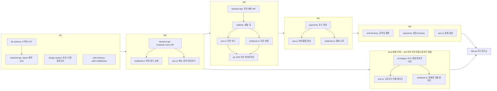

# 11. 서브에이전트 구성 & 오케스트레이션 개발 계획

- 버전: v0.1 (2026-07-12)
- 이 문서는 Claude Code로 본 프로젝트를 **멀티 에이전트 병렬 개발**하기 위한 운영 계획이다. 에이전트 정의 파일은 `.claude/agents/*.md`, 오케스트레이터 상시 규칙은 `CLAUDE.md`.

## 1. 조직 구조

```mermaid
flowchart TD
    O["오케스트레이터 (메인 세션)<br/>계약 확정·fan-out·통합·마감"]
    O --> DS[design-system<br/>packages/ui]
    O --> DB[db-schema<br/>packages/db]
    O --> BE[backend-api<br/>src/server, app/api]
    O --> LB[lookbook-ui<br/>app/(store)]
    O --> POS[pos-ui<br/>app/(admin)]
    O --> RT[realtime<br/>src/realtime]
    O --> AT[auth-tenancy<br/>src/auth, middleware, app/(platform)]
    O --> PAY[payments<br/>src/payments, webhooks]
    O --> AII[ai-imagery<br/>src/ai, api/admin/ai]
    O --> QA[qa<br/>tests — 전 영역 읽기 전용]
```

**오케스트레이터의 일**: 직접 코딩은 스캐폴드·통합 접착·문서 갱신으로 최소화하고, ① 마일스톤 계획 ② 계약 확정 ③ 병렬 위임 ④ 산출물 통합·충돌 해소 ⑤ 검증 게이트 집행 ⑥ 진행 상태(docs/10) 관리에 집중한다.

## 2. 에이전트 로스터

| 에이전트 | 미션 | 소유 경로(쓰기) | 필독 문서 | 주 검증자 |
|---|---|---|---|---|
| `db-schema` | 스키마·마이그레이션·시드가 곧 계약 | `packages/db/**` | 03 | qa(계약 테스트) |
| `design-system` | 에디토리얼 토큰·공용 UI로 두 표면의 일관성 담보 | `packages/ui/**` | 05 §1·6, 06 §1 | lookbook-ui/pos-ui(소비자) |
| `backend-api` | 도메인 불변식을 지키는 API·서비스·repository | `apps/web/src/server/**`, `apps/web/app/api/**`(webhooks 제외), `packages/shared/**` | 02 §5, 03 §4, 04 | qa |
| `lookbook-ui` | '잡지 같다'는 감탄이 나오는 고객 표면 | `apps/web/app/(store)/**` | 05, 04 §2 | qa + 오케스트레이터(시각 리뷰) |
| `pos-ui` | 놓치지 않고 두 번 탭 이내로 끝나는 POS | `apps/web/app/(admin)/**` | 06, 04 §3 | qa |
| `realtime` | 3초 알림 + 유실 0 폴백 상태기계 | `apps/web/src/realtime/**` | 07 | qa(단절 시나리오) |
| `auth-tenancy` | 인증·테넌트 격리·온보딩·플랜 게이트 | `apps/web/src/auth/**`, `apps/web/middleware.ts`, `apps/web/app/(platform)/**` | 02 §4-5, 09 | qa(격리 테스트) |
| `payments` | 돈이 맞는 결제·환불·빌링 | `apps/web/src/payments/**`, `apps/web/app/api/webhooks/**` | 08 | qa(방어 규칙) |
| `ai-imagery` | 재료 입력→화보급 실사 연출컷 생성 파이프라인 | `apps/web/src/ai/**`, `apps/web/app/api/admin/ai/**` | 12 | qa(크레딧·노출 차단) + 오케스트레이터(품질 블라인드 평가) |
| `qa` | 계약·불변식·수용 기준을 테스트로 고정 | `apps/web/tests/**`, `packages/*/tests/**`, `*.test.ts`(전 위치) | 전부(§9 수용 기준 위주) | 오케스트레이터 |

**공유 자원 규칙**:
- `packages/shared`(Zod 계약)는 backend-api가 쓰기 소유하되, 변경은 계약 변경이므로 오케스트레이터 승인 + 단독 커밋.
- 다른 에이전트 소유 경로에 필요한 변경(예: lookbook-ui가 API 필드 추가 필요)은 직접 수정 금지 → 산출물 보고에 "요청사항"으로 명시 → 오케스트레이터가 소유 에이전트에게 전달.

## 3. 오케스트레이션 원칙

1. **Contract-first**: fan-out 전에 계약물(스키마/Zod/이벤트/토큰)을 커밋. 병렬 에이전트는 계약만 보고 서로를 몰라도 된다.
2. **소유권 = 충돌 방지**: 위 표의 경로 밖은 쓰기 금지. 예외 없이 지켜지면 병렬 머지가 안전하다. 불가피하게 겹치면 `isolation: worktree`로 격리 후 오케스트레이터가 수동 머지.
3. **문서 참조 주입**: 위임 프롬프트에 필독 문서 경로와 마일스톤 DoD를 항상 포함(에이전트는 세션 컨텍스트를 공유하지 않는다).
4. **작게 위임, 자주 통합**: 에이전트 1회 위임 분량은 "반나절 개발자" 수준(화면 1~2개, API 3~5개). 마일스톤을 2~4회의 fan-out 라운드로 쪼갠다.
5. **검증은 남이**: 만든 에이전트가 아닌 qa가 검증하고, 시각 품질(룩북)은 오케스트레이터가 스크린샷으로 확인 후 필요 시 사용자에게 공유.
6. **재위임은 SendMessage**: 수정 루프는 새 에이전트를 만들지 말고 기존 에이전트에 SendMessage로 컨텍스트를 이어간다.

## 4. 마일스톤별 실행 DAG



같은 서브그래프 안에서 화살표가 없는 노드끼리는 **병렬**이다. (M1: 3개 병렬 / M2: UI 2개 병렬 / M3: POS·룩북 병렬 / M4·M5: 3개 병렬)

## 5. 위임 프롬프트 템플릿 (오케스트레이터용)

```text
[역할] 너는 {agent} 에이전트다. .claude/agents/{agent}.md 의 규칙을 따른다.
[마일스톤] M{n} — 목표: {docs/10 해당 절 요약}
[과업] {구체 작업 목록 3~7개, 화면/엔드포인트 단위}
[계약] 반드시 준수: docs/{계약 문서·절}, packages/shared/src/contracts/{파일}
[소유권] 쓰기 허용: {경로}. 그 외 수정 금지. 다른 영역 변경 필요 시 보고서에 '요청사항'으로.
[완료 기준] {DoD 항목}. pnpm typecheck && lint && test 그린 상태로 종료.
[보고 형식] 변경 파일 목록 / 계약 이행 확인 / 남은 이슈 / 요청사항
```

## 6. Workflow 스크립트 예시 (M3 병렬 라운드)

수동 fan-out 대신 Workflow 도구로 라운드를 코드화할 수 있다(사용자가 오케스트레이션 실행을 지시한 경우). 아래는 M3 2라운드 예시:

```js
export const meta = {
  name: 'm3-order-pipeline',
  description: 'M3: 주문 API → (realtime ∥ 이후 POS·룩북 병렬) → qa 검증',
  phases: [
    { title: 'API', detail: '주문·세션·호출 API' },
    { title: 'UI', detail: 'POS 보드 ∥ 룩북 카트·현황' },
    { title: 'Verify', detail: 'qa E2E + 교차 리뷰' },
  ],
}

phase('API')
const api = await agent(
  '[역할] backend-api … docs/03 §3-4, docs/04 §2-3 준수. 주문 생성(스냅샷·멱등·orderNo)·상태 전이·세션·호출 API 구현 …',
  { label: 'backend-api:orders' }
)

const rt = await agent(
  '[역할] realtime … docs/07 전체. publish 함수 + useStoreOps 폴백 상태기계 구현 …',
  { label: 'realtime:channels', phase: 'API' }
)

phase('UI')
const ui = await parallel([
  () => agent('[역할] pos-ui … docs/06 §3 주문 보드 + 호출 스트립 …', { label: 'pos-ui:board', phase: 'UI' }),
  () => agent('[역할] lookbook-ui … docs/05 §3.5-3.6 카트·전송·현황 …', { label: 'lookbook-ui:order', phase: 'UI' }),
])

phase('Verify')
const verdict = await agent(
  '[역할] qa … docs/06 §9 수용 기준 A-1·A-2·A-3·A-5를 Playwright E2E로 작성·실행하고 결과를 보고 …',
  { label: 'qa:e2e-m3', schema: { type: 'object', properties: {
      passed: { type: 'boolean' }, failures: { type: 'array', items: { type: 'string' } } },
      required: ['passed', 'failures'] } }
)
return { api, rt, ui, verdict }
```

- 실패(`verdict.passed === false`) 시 오케스트레이터가 failures를 소유 에이전트에게 SendMessage로 재위임하는 수정 루프를 돈다(스크립트로 루프화해도 좋다).
- UI 에이전트가 같은 파일을 만질 일은 소유권상 없으므로 worktree 없이 병렬 가능. `packages/shared`를 건드려야 하는 라운드만 순차화한다.

## 7. 품질 게이트 (마일스톤 마감 조건)

1. `pnpm typecheck && pnpm lint && pnpm test` 그린 (에이전트 각자 + 통합 후 재실행)
2. qa 에이전트의 마일스톤 수용 테스트 그린
3. `/code-review` 실행 → CONFIRMED 결함 0 잔존 (수정 후 재리뷰)
4. 주문·결제 터치 시: 불변식 I-1~I-7(docs/03 §4)·방어 규칙 P-1~P-5(docs/08 §4) 테스트 존재 확인
5. 룩북 변경 시: 데모 매장 스크린샷(모바일 뷰포트) 생성 → 사용자 공유(시각 승인 루프)
6. docs/10 체크박스 갱신 + 마일스톤 태그 커밋

## 8. 세션 운영 가이드 (사람 사용자용)

- 시작: `cd table-order && claude` → "docs/10 기준 다음 마일스톤 진행해줘"
- 마일스톤 중간에 세션이 끊겨도: docs/10 체크박스 + git log가 상태를 보존한다. 새 세션은 CLAUDE.md → docs/10 순으로 읽고 재개한다.
- 사람의 개입 지점(권장): 각 마일스톤 마감 리뷰, 룩북 시각 승인(M2), 결제 실거래 수동 테스트(M4), 베타 매장 선정(M6). 그 외는 에이전트 자율.
- 대규모 병렬 실행(Workflow)은 토큰 소모가 크므로 사용자가 명시적으로 지시할 때만 사용하고, 평시에는 Agent tool 단위 fan-out으로 충분하다.
