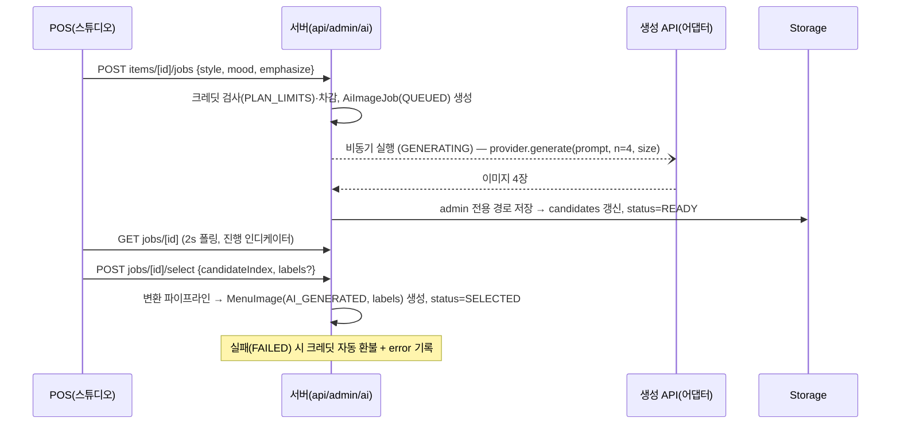

# 12. AI 연출컷 스튜디오 — 재료 입력 → 실사 이미지 생성

- 버전: v0.1 (2026-07-12)
- 구현 소유: `ai-imagery` 에이전트 (`apps/web/src/ai`, `app/api/admin/ai`). 스튜디오 UI는 `pos-ui`, 고객측 라벨 렌더는 `lookbook-ui`(docs/05 §4).
- 마일스톤: **M-AI** (병렬 트랙, docs/10)

## 1. 목적

레퍼런스 R3(재료 분해컷)처럼, **매장 운영자가 각 메뉴의 식재료를 디테일하게 입력하면 AI가 먹음직스러운 실사(photorealistic) 연출 이미지를 생성**한다. 전문 촬영이 없는 매장도 룩북의 시각 기준을 충족하게 하는 안전망이자 차별 기능이다.

생성 스타일 3종 (`AiImageStyle`):

| 스타일 | 설명 | 룩북 배치 |
|---|---|---|
| `HERO` | 완성 요리 스테이징 컷 — 소품·조명·무드 연출 (R2 무드) | 스프레드 카드·디테일 컷 첫 장 |
| `DECONSTRUCTED` | 재료 공중 부양 분해컷 — 세로 스택, 다크 배경, 라벨은 별도 오버레이 (R3) | 디테일 컷 '재료' 장 |
| `CLOSEUP` | 질감 클로즈업 — 단면·시즐·스팀 | 디테일 컷 보조 장 |

## 2. 운영자 UX 플로우 (POS 메뉴 관리 내 '스튜디오', docs/06 §5)

```
① 재료 입력  : 메뉴 폼의 ingredients 리스트 재사용 [{name, note, emphasize}]
              예) 메밀면 / 들기름(강조) / 발효 간장 / 구운 김 / 절임 오이
② 설정      : 스타일(HERO|DECONSTRUCTED|CLOSEUP) · 무드(다크 우드|한지 라이트|스톤|린넨) · 강조 재료 선택
③ 생성      : [생성] 클릭 → 크레딧 1 차감 → 잡 시작 (p95 < 60s, 진행 인디케이터)
④ 후보 비교  : 후보 4장 그리드 → 확대 토글 → 1장 선택 (전부 별로면 폐기)
⑤ 라벨 편집  : (분해컷) 재료명 라벨 자동 초기 배치 → 드래그로 위치 조정·문구 수정
⑥ 적용      : 변환 파이프라인(리사이즈·blurhash·지배색) → MenuImage(source=AI_GENERATED) → 디테일 컷 편입
```

- 미검수 후보는 어떤 경우에도 고객 표면에 노출되지 않는다(**불변식 I-8**). 후보는 admin 전용 Storage 경로에만 존재하며, 룩북 쿼리는 MenuImage만 읽는다.
- 사진이 하나도 없는 메뉴에는 룩북 폴백 카드와 POS 리스트에 "AI 연출컷 만들기" 제안 배지를 띄운다(docs/05 §8).

## 3. 프롬프트 엔지니어링 (템플릿은 코드+픽스처로 관리)

구조화 입력 → 문장 조립. 최종 프롬프트는 `AiImageJob.prompt`에 스냅샷(재현·감사 가능).

```
[공통]   professional food photography, photorealistic, appetizing, natural steam,
         high detail, no text, no watermark, no logo, no hands, no people
[요리]   {dish.name} — {summary}. key ingredients: {ingredients (+emphasized 가중 서술)}
[무드]   {mood 프리셋: dark rustic wood table / bright hanji paper backdrop / stone slate / linen}
[스타일] HERO         → styled table setting, side props, soft window light, 45-degree angle
         DECONSTRUCTED → deconstructed levitation food photography, ingredients floating
                         in a vertical stack above the bowl, dark moody backdrop,
                         clear separation between ingredients (라벨 오버레이 공간 확보)
         CLOSEUP      → extreme close-up, texture detail, shallow depth of field
[출력]   4:5 portrait, 4 variations
```

- **텍스트/라벨은 이미지에 굽지 않는다**(negative에 no text) — 라벨은 우리 렌더러가 데이터로 오버레이(docs/05 §4). AI가 글자를 그리면 오탈자·저해상 문제가 생기기 때문.
- 금지 입력 필터: 인물·타 브랜드 로고·특정 매장 사진 모사 요청. 위생/식품 외 오브젝트 감지 시 재생성 안내.

## 4. 파이프라인 아키텍처



- **제공자 어댑터**: `interface ImageGenProvider { generate(req: GenRequest): Promise<GenResult> }` — 구현 교체 가능(`imagen`, `gpt-image`, …). 벤더 종속 금지.
- **2단계 생성(원가 최적화)**: 후보 4장은 **저해상(512~768px) 프리뷰**로 생성 → 운영자가 선택한 1장만 고해상 재생성/업스케일 후 변환 파이프라인 합류 — 회당 원가 약 60% 절감. 프리뷰는 admin 전용 경로에만 저장(I-8 동일).
- 실행 환경: Vercel 서버리스(최대 실행시간 내 분할 — 후보 4장은 병렬 호출). 타임아웃 120s 초과 시 FAILED 처리·환불.
- 상태머신: `QUEUED → GENERATING → READY → (SELECTED | DISCARDED)`, 어느 단계든 `→ FAILED(환불)`.

## 5. 크레딧·비용 통제

- 플랜별 월 크레딧: `PLAN_LIMITS.aiCreditsMonthly` (FREE 3회 1회성 / TRIAL 10 / BASIC 5/월 / PRO 50/월 — 가설, docs/09 §3). `Subscription.aiCreditsUsed` 월 리셋. 애드온 10회 ₩9,900.
- 차감 시점 = 잡 생성 트랜잭션. FAILED·타임아웃 시 자동 환불(정합 테스트 필수). DISCARDED는 환불 없음(생성은 소비됨).
- **유닛 이코노믹스 게이트(docs/13 §5와 연동)**: 생성 1회 원가 상한 **300원**(저해상 4장+고해상 1장 합산, env로 강제). PRO 풀사용 시 AI 원가 ≤ 15,000원(요금의 25%), 매장 blended COGS ≤ 요금의 30%(매출총이익률 ≥ 70%).
- 남용 방지: 매장당 동시 실행 잡 1개, 생성 rate limit 10회/시간.

## 6. 정책·가드레일

| # | 정책 |
|---|---|
| G-1 | **검수 승인제**: 운영자 선택 전 고객 노출 0 (I-8, qa 회귀) |
| G-2 | **AI 생성 고지**: 적용된 컷 모서리에 소형 `AI 생성` 배지 기본 ON — 표시광고법상 실물 오인 방지. 문구·노출은 매장 설정, 최종 책임 고지는 약관에(docs/09 §6 법무 체크리스트와 연동) |
| G-3 | 실물과의 괴리 최소화 가이드: 스튜디오에 "실제 제공 형태와 크게 다르지 않게 — 재료는 실제 들어가는 것만" 안내 문구. 실물 참고사진 첨부 조건 생성은 백로그 |
| G-4 | 생성물 저작권·이용 조건: 채택 제공자의 상업 이용 약관 확인을 PoC 항목에 포함 |
| G-5 | 프롬프트에 개인 정보·타사 상표 유입 금지(입력 필터) |

## 7. 제공자 선정 PoC (M-AI 착수 첫 작업, ai-imagery 수행)

1. 고정 벤치마크 20종(한식/양식/디저트/음료 × 스타일 3종) 프롬프트 픽스처 작성
2. 후보 제공자(Gemini API Imagen 계열, OpenAI gpt-image, 기타 1)에 동일 실행
3. 블라인드 평가: 오케스트레이터+사용자에게 HTML 비교 시트 제출 — 식욕도/실사성/스타일 준수/한식 표현력 4축 채점
4. 단가·지연(p50/p95)·상업 이용 약관 표와 함께 **디폴트 제공자 확정** → 어댑터 디폴트 설정. 합격 게이트: **회당 원가 ≤ 300원**(2단계 생성 기준) — 미달 제공자는 품질이 좋아도 기각
5. 산출물: `docs/12` 부록으로 PoC 결과 기록

## 8. 테스트 (qa 협업)

- 어댑터 모킹 단위: 상태머신 전이 전수, 타임아웃→FAILED→환불
- 크레딧 정합: 차감/환불/월 리셋/한도 초과 `AI_CREDIT_EXHAUSTED`
- **노출 차단 회귀(중요)**: 후보 URL이 lookbook 응답·고객 접근 가능 경로에 절대 등장하지 않음
- 라벨: select 시 labels 저장 → 룩북 렌더 스냅샷(위치·충돌 회피)
- 프롬프트 템플릿: 픽스처 스냅샷 테스트(의도치 않은 템플릿 드리프트 방지)
